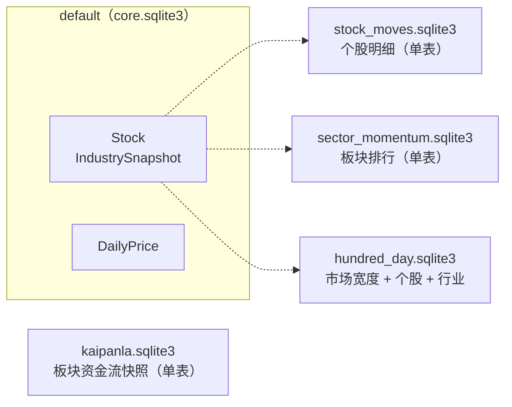
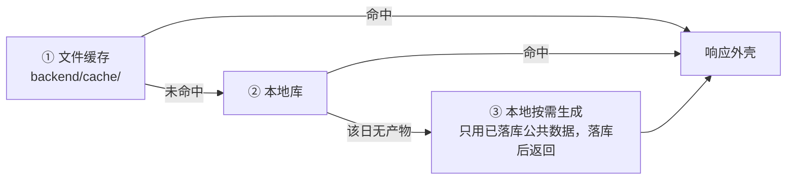
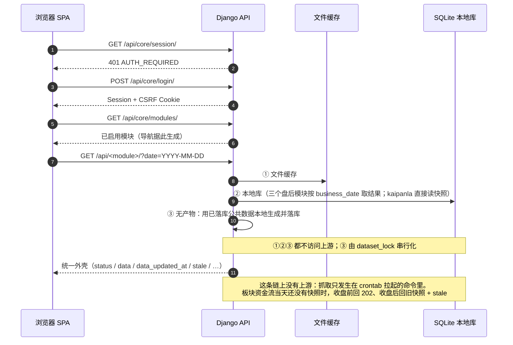
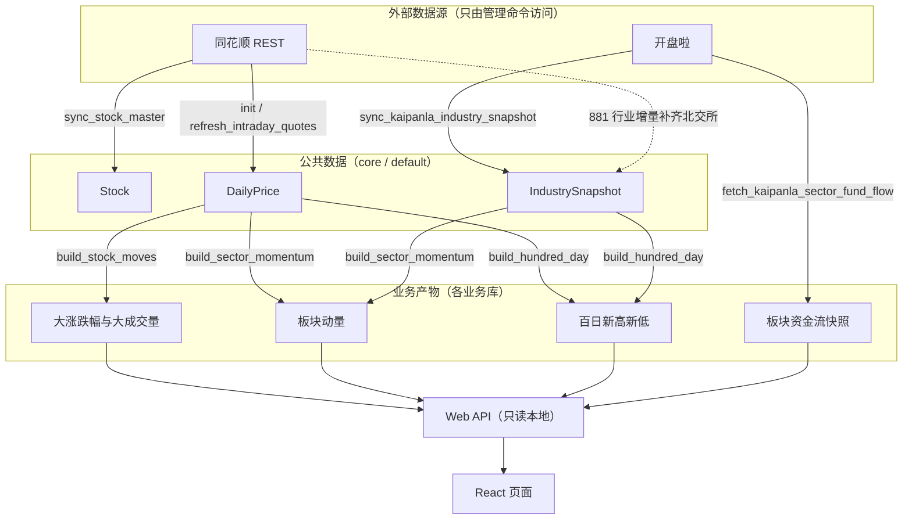
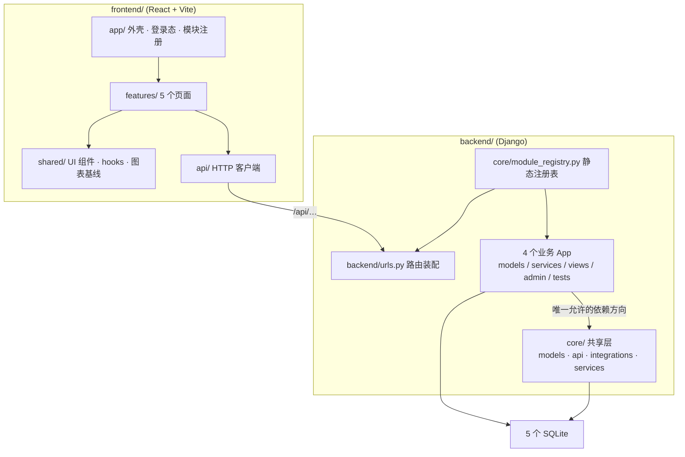

# A 股市场复盘

将「开盘啦板块资金流」和三个盘后结构分析模块整合为一个 Django + React 应用：本地 SQLite 落地公共行情与板块关系，管理命令负责采集与计算，Web API 只从本地读，前端只消费 API。

设计上有两条硬边界，全文都围绕它们展开：

1. 业务模块之间零依赖。四个业务模块通过静态注册表启用，彼此不能互相 import，也不能互相读库；它们只能依赖不可删除的 `core` 共享层。`core` 不反向依赖任何业务模块。
2. 采集与读取分离。上游数据只由管理命令写入，Web 请求不触发全市场采集。页面读不到数据时，按「文件缓存 → 本地库 → 用已落库数据本地生成」的顺序降级，不访问上游抓取。

---

## 文档导航

| 文档 | 内容 |
| --- | --- |
| 本文件（README） | 总览：功能 / 数据库 / Web API / 命令 / 工作流 / 代码结构 / 开发与生产运维 / 排查 |
| [`docs/specs/integration-spec.md`](docs/specs/integration-spec.md) | 整合规格：能力地图、数据契约、异常边界、可测试验收标准 |
| [`docs/acceptance/traceability.md`](docs/acceptance/traceability.md) | 规格条款 → 自动化/人工证据的映射矩阵、基线数字、已知缺口与待执行的运行时验收 |
| [`docs/ops/deployment.md`](docs/ops/deployment.md) | 部署与运行：`.env` 清单、五个库的迁移、**crontab 与采集调度（完整 crontab 块、时刻表、跳过与失败语义）**、gunicorn + systemd、Nginx 配置与 HTTPS、备份回滚 |
| [`docs/ops/manage-commands.md`](docs/ops/manage-commands.md) | `python manage.py` 命令手册：参数、失败语义、日志、调度频率与约束、故障排查 §10 |
| [`docs/data-sources/web-api.md`](docs/data-sources/web-api.md) | 上游 Web API：开盘啦与同花顺的接口、参数、响应字段、调用示例；§6 为已批准的数据源边界与实施约束 |
| [`AGENTS.md`](AGENTS.md) | 仓库协作约定：目录组织、开发命令、编码与测试规范、配置铁律、数据源边界，以及「有意设计、不要顺手统一」的清单。它由 IDE 在仓库根目录自动加载，因此不放在 `docs/` 下 |

---

## 1. 功能设计

### 1.1 模块一览

| 模块 | 导航分组 | Django App | API 前缀 | 前端路由 | 数据来源 / 用途 |
| --- | --- | --- | --- | --- | --- |
| 开盘啦 | 板块资金流 | `kaipanla` | `/api/kaipanla/` | `/fund-flow/kaipanla` | 开盘啦板块资金流排行（盘中 5 分钟快照 + 分时历史） |
| 大涨跌幅与大成交量个股 | 盘后结构分析 | `stock_moves` | `/api/stock-moves/` | `/stock-moves` | 本地公共日行情，按上证/深证/北交所分组 |
| 板块动量 | 盘后结构分析 | `sector_momentum` | `/api/sector-momentum/` | `/sector-momentum` | 本地日行情 + 开盘啦行业关系 |
| 百日新高新低占比 | 盘后结构分析 | `hundred_day` | `/api/hundred-day/` | `/hundred-day` | 本地日行情 + 开盘啦行业关系 |

模块定义集中在 `backend/core/module_registry.py`，这是模块信息的来源。`INSTALLED_APPS`、`backend/urls.py` 的路由装配、`/api/core/modules/` 的导航响应三处都从它派生，不手工维护。需要人工对齐的是 `.env` 的 `ENABLED_MODULES`，少写一个 id 就会关闭该模块。新增模块时，还要在 `frontend/src/app/moduleRegistry.js` 补一条「模块 id → 页面组件」映射，否则该页只显示占位内容。

### 1.2 用户流程

1. 未登录访问任意页面时，前端 `AuthGate` 先请求 `/api/core/session/`，收到 401 后显示登录页。
2. 登录成功后（`POST /api/core/login/`），前端请求 `/api/core/modules/`，按返回的 `navigation_group` / `navigation_order` 生成顶栏标签，默认选中第一个模块。
3. 进入任一模块时，默认请求不带 `date`，由后端解析「最新完整公共行情日」；用户可用日期控件选择可用的历史交易日。
4. 数据未就绪时，页面显示准备中或空状态，不影响其他模块。开盘啦因上游 403/429/超时失败时保留旧数据，其他模块照常工作。

### 1.3 关键设计取舍

| 取舍 | 做法 | 原因 |
| --- | --- | --- |
| 读不到数据怎么办 | 本地按需生成派生结果，不访问上游 | 页面可用性不应依赖外部上游 |
| 派生结果什么时候算 | 请求该日期且本地无产物时再计算 | 避免为每个交易日预跑全量；实现在各模块 `services/read_path.py` |
| 并发重复计算 | `dataset_lock(module_id, dataset_key)` | 同一数据集同一时刻只允许一个执行者，竞争者拿到 409 |
| 停用一个模块 | `ENABLED_MODULES` 少写一个 id | URL 不挂载、导航不出现；被停模块的前缀统一由 `module_disabled_view` 回答 404 + `MODULE_DISABLED`，不会退化成 Django HTML 404 |

### 1.4 行业口径

行业关系只有一层，没有父子层级，全链路统一使用开盘啦 `881xxx` 行业族：`.env` 的 `KAIPANLA_INDUSTRY_PARENT_ZS_TYPE` 与 `KAIPANLA_FLOW_ZS_TYPE` 必须同族，都是 `4`（配套 `Type=1`）。北交所 313 只 `920xxx` 在开盘啦 881 里用的是旧代码（43/83/87），由同花顺 881 成分股以只增不删的方式补齐归属 —— 这只补归属，不改变「行业关系以开盘啦为准」的口径。

同族的强制约束、补齐开关 `HITHINK_INDUSTRY_BACKFILL_ENABLED` 与它的失败语义见 [`docs/specs/integration-spec.md`](docs/specs/integration-spec.md) §5.2.3。

---

## 2. 数据库设计

> 本节是**总览**：布局图、表清单与设计取舍。规范性契约（跨库外键禁令、各 App 只读写自己的库、`core` 没有版本表与运行状态表）以 [`docs/specs/integration-spec.md`](docs/specs/integration-spec.md) §5.1–§5.3 为准。

### 2.1 五库布局

`core` 写 `default`，每个业务 App 写自己的同名库；路由由 `backend/backend/db_router.py` 依据模块注册表推导，是恒等映射（app 名 = 库名）。



`kaipanla` 不参与跨库协作：它的快照直接从上游采集，不由公共日行情派生，因此既不读也不写 `default` 库，读路径只查自己这一张表。其余三个模块是公共数据的派生结果，读的是 `default` 库里的 `DailyPrice` / `IndustrySnapshot`。

所有库都是 SQLite，`TIME_ZONE=Asia/Shanghai` 且 `USE_TZ=True`，因此 DateTimeField 存的是 UTC，用 sqlite3 直读要 +8 小时才是北京时间；`DateField`（业务日期）按自然日存，不受时区影响。

### 2.2 公共层（`default`）

| 表 | 关键字段 | 说明 |
| --- | --- | --- |
| `Stock` | `thscode`(uniq)、`stock_code`(uniq)、`stock_name`、`exchange`(SH/SZ/BJ)、`is_active` | A 股主数据；退市/停牌只置 `is_active=False`，不删行 |
| `IndustrySnapshot` | `industry_code`(uniq)、`industry_name`、`stock_codes`(JSON) | 行业 → 股票代码列表；一只股票可属多个行业（多重归属） |
| `DailyPrice` | `stock`(FK PROTECT)、`trade_date`、`pre_close` / `open/high/low/close`、`change_percent`、`volume`、`turnover`、`has_valid_trade`、`source_batch_id` | 公共前复权日行情，(stock, trade_date) 唯一 |

公共层只有这三张表。数据集是否发布由当天是否有结果行判断，命令运行情况由日志记录，不维护额外的版本表或运行状态表。相关取舍见 §2.4。

### 2.3 业务层：一个模块一张表（`hundred_day` 三张）

三个盘后模块的读路径结构相同（见 §3.4），表结构也尽量精简。设计原则是：能在读取时从同一批行算出的数字，不单独占一列。

| 模块 | 表 | 关键字段 |
| --- | --- | --- |
| `kaipanla` | `KaipanlaSectorFundFlowSnapshot` | `sector_code`、`trade_date`、`snapshot_time`(5 分钟对齐)、`change_pct`、`main_net_inflow`、`main_buy`、`main_sell`、`large_order_net_inflow`、`volume_ratio`、`turnover_amount`、`float/total_market_cap` |
| `stock_moves` | `StockMoveItem` | `business_date`、`group`、`rank`、`stock_code/name`、`industries`(JSON)、`change_percent`、`turnover`、`published_at` |
| `sector_momentum` | `SectorMomentumRanking` | `business_date`、`metric`、`industry_code/name`、`stocks`(JSON)、`total_market_turnover`、`unmapped_stock_count`、`published_at` |
| `hundred_day` | `HundredDayBreadth`（交易日粒度）、`HundredDayStockFlag`（股票粒度）、`HundredDayIndustrySummary`（行业粒度） | 见下 |

四个业务模块中，只有 `kaipanla` 的业务表保留上游完整字段。它的 `change_pct`、`main_buy`、`main_sell`、`large_order_net_inflow`、`volume_ratio`、`turnover_amount`、`float_market_cap`、`total_market_cap` 这 8 列目前没有读路径消费者（页面只读 `main_net_inflow`），但这些字段来自上游同一行响应，不能由本表其他行推导。删除后需要重新采集才能恢复，因此保留；原因也写在 `kaipanla/models.py` 顶部。

读取时计算、不落库的数字如下：

- `stock_moves`：六组计数（`sse/szse/bse` × `rise/fall`）、`distinct_stock_count`、`stock_codes`，以及两条非致命告警（`stock_name` 为空 / `industries` 为空）。这些都可由当天的结果行计算出来。
- `sector_momentum`：`rank`、`stock_count`、`average_change_percent`、`industry_turnover`、`market_turnover_ratio`、`score`。它们由该行的 `stocks` 加上日级的 `total_market_turnover` 算出。`rank` 是 `sorted(key=(-score, industry_code))` 的位置，与写入时的排序规则同源。
- `hundred_day`：行业级的 `new_high_count` / `new_low_count` 与两个股票名单，以及所有比值（`new_high_ratio` / `new_low_ratio`）。

`stock_moves` 与 `sector_momentum` 都用单表保存：结果数字都能从明细行计算出来，单独保存只会增加不一致风险。日级事实（`business_date` 与下面提到的 `published_at`）放在明细行上，一次构建中同一天的每一行使用同一个值，因此取任意一行都一致。六组计数、去重股票数与五个板块数值均可由明细行零误差重算。

`published_at` 承担两项职责：

- 它是页面工具栏「更新于 HH:MM」的来源（信封里的 `data_updated_at`）；
- 它也是文件缓存的缓存身份（`core/services/read_path.py` 里 `cache_identity = result.published_at.isoformat()`）。

因此它不使用 `auto_now_add`，由写入方在每次构建时显式赋值。同一天重跑时，缓存键必须随之变化，否则页面会在 `FILE_CACHE_TTL_SECONDS`（默认 300 秒）内继续拿到上一版报文。重跑采用先删后写，原因是 `update_or_create` 不会刷新写入时刻。

`hundred_day` 使用三张表。`valid_stock_count`（当日全市场有效交易股票数）、行业的 `stock_count`（包含未被标记的成分股，例如 36 只成分股、0 新高 0 新低）和趋势的 100 个点，都无法从被标记股票的行中推出。如果压成一张表，就要写入全部约 5,571 只股票 × 最近 100 个交易日（约 55.7 万行/发布日，对比现在 535 行），相当于把 `core` 的日线整段复制进模块库。因此按三个粒度分别存储：

- `HundredDayBreadth`：一个交易日一行，`business_date` + `trade_date` 唯一。它同时承载走势图与「当日结果」；`trade_date` 等于 `business_date` 的那一行就是当日汇总。比值不落库，由两个计数除以 `valid_stock_count` 得出。
- `HundredDayStockFlag`：被标记股票的存放点，`business_date` + `stock_code` 唯一。行业归属 `industries` 是快照，必须随标记落库，不能读时回查公共行情；每只股票要展示的当日 `change_percent` / `turnover` 也在这里。
- `HundredDayIndustrySummary`：只保留 `stock_count`。行业级的两个计数与两个名单由读路径按 `industries` 分组现算；计数与名单来自同一次分组，因此不会互相矛盾。

三张表之间没有外键，归属由 `business_date` 这个普通列表达。跨库外键在分库配置下无法成立，同库内也没有必要建。

行业名单不落库，由读路径按 `industries` 分组重建。若把名单写成 JSON，`HundredDayStockFlag` 中属于多个行业的股票会在每个行业下重复展开；重建后的行业行与按行业分组的名单逐字段一致，明细体积减少约 86%。每只股票的当日涨幅与成交额保存在 `HundredDayStockFlag`。

三个盘后模块只保存结果行，不额外维护运行表。`build_*` 可以在一个事务里写完全部结果；`source_batch_id` 随公共日行情行保存（见 §2.2），派生结果不必重复存储。

全链路遵循「写行即发布」：

- `build_*` 在一个 `transaction.atomic()` 里先删除该日全部行，再整批重建，提交后即可读取；
- `fetch_kaipanla_sector_fund_flow` 的一次完整采集是一个事务里的 `INSERT ... ON CONFLICT DO UPDATE`；采集不完整时一行都不写，只在日志中记录上游声称多少行、实际收到多少行、哪一页失败，事件名为 `kaipanla_collection_incomplete`；
- 读路径不判断数据是否已发布。事务边界保证读者不会在发布中途读到半份数据，因此不需要额外过滤。

单表化带来一个副作用：在表里无法区分「这一天一行都没有」和「这一天没算过」。三个模块的读路径各自提供一个轻量的「Day」载体（`StockMoveDay` / `SectorMomentumDay` / `HundredDayBreadth` 本身），即使没有任何结果行也能构造出来。一天里没有股票达到阈值时，页面仍会渲染空看板，不会把这一天报成 404。`hundred_day` 不需要这个兜底，因为市场宽度点与被标记的股票无关，每个交易日都有一行。

### 2.4 派生结果的重算时机

公共数据重算后，已经写好的派生结果不会自动失效。读路径只按 `business_date` 查找结果行，找到就直接返回，因此重跑公共数据后需要手动重跑对应日期的 `build_*`。

三个盘后模块只按 `business_date` 识别结果，`published_at` 由写入方设置。当天没有结果行时，读路径使用已落库的公共数据本地生成结果（见 §3.4），生成完成后即可读取。文件缓存仍会比较 `published_at`（见 §2.3）。

`kaipanla` 的结果直接来自上游快照，不依赖公共输入数据。它的缓存身份使用当天最新采集槽（`kaipanla:<date>T<HH:MM>`，见 §6.1），采集槽变化时缓存键也随之变化。

---

## 3. Web API 设计

> 本节是**总览**：路由总表与前端视角的字段用法。规范性契约（参数约束、`preparation.state` 取值域、错误码全集、202/404 判定规则）以 [`docs/specs/integration-spec.md`](docs/specs/integration-spec.md) §5.5–§5.8 为准。

### 3.1 路由总表

| 方法 | 路径 | 说明 |
| --- | --- | --- |
| `GET` | `/api/core/session/` | 当前登录态；未登录 401 `AUTH_REQUIRED` |
| `POST` | `/api/core/login/` | 登录，成功下发 Session/CSRF Cookie；失败过多 429 `TOO_MANY_ATTEMPTS` |
| `POST` | `/api/core/logout/` | 登出 |
| `GET` | `/api/core/health/` | 健康检查；只记 DEBUG 访问日志。`data.trading_calendar` 附带 `chinese-calendar` 的覆盖边界（`next_year_covered=false` 即需升级依赖） |
| `GET` | `/api/core/modules/` | 已启用模块清单（驱动前端导航） |
| `GET` | `/api/kaipanla/sectors/` | 板块资金流排行；`?date=` |
| `GET` | `/api/kaipanla/sectors/intraday/` | 当天分时；横轴恒为完整交易时段（09:30–11:30 / 13:00–15:00 共 50 个五分钟槽），曲线只画到最后一个已采集时点；`?date=`、`?inflow_top=`/`?outflow_top=`（0–30，默认 5） |
| `GET` | `/api/kaipanla/sectors/intraday/history/` | 历史分时；`?date=`、`?days=`（仅 1/5/10/20，默认 5）、`?inflow_top=`/`?outflow_top=` |
| `GET` | `/api/kaipanla/dates/` | 有数据的交易日列表（无参数） |
| `GET` | `/api/stock-moves/` 与 `/api/stock-moves/dates/` | 结果 / 可用日期 |
| `GET` | `/api/sector-momentum/` 与 `/api/sector-momentum/dates/` | 结果 / 可用日期 |
| `GET` | `/api/hundred-day/` 与 `/api/hundred-day/dates/` | 结果 / 可用日期 |
| `GET` | `/admin/` | Django 后台：查看公共数据与各模块结果（只读，不提供在线重跑；运行状态记录在命令日志中） |

三个盘后模块的 `results` 与 `dates` 由同一份 `core/api/read_endpoints.py` 生成，仅文案和 `hundred_day` 多出的一条「历史不足」规则不同。这样状态码与错误码只有一套实现。

### 3.2 统一响应外壳

所有 JSON 端点回答同一个外壳，前端因此只需实现一套状态处理：

```json
{
  "status": "ok",
  "business_date": "2026-09-12",
  "generated_at": "2026-09-12T15:45:03.128452+08:00",
  "data_updated_at": "2026-09-12T15:40:12.337914+08:00",
  "stale": false,
  "source": "database",
  "preparation": { "state": "ready", "retry_after_seconds": null },
  "warnings": [],
  "error": null,
  "data": {}
}
```

| 字段 | 取值 | 前端怎么用 |
| --- | --- | --- |
| `status` | `ok` / `partial`（有 `warnings`）/ `preparing` / `error` | 决定是否展示告警条 |
| `business_date` | 该响应实际所属交易日 | 与用户选择的日期比对，不一致时提示「展示的是 X 日数据」 |
| `generated_at` | 服务端拼出这个响应体的时刻（本地时区） | 供排障使用，不作为「更新于」显示的值。它每次请求都会变化，包括命中缓存的那次 |
| `data_updated_at` | 这份数据写进数据库的时刻（本地时区；无数据时为 `null`） | 工具栏「更新于 HH:MM」显示的就是它：三个盘后模块取所服务结果行的 `published_at`，板块资金流取当天最新采集槽那批行的 `created_at` |
| `stale` | 是否在服务旧产物 | 展示「正在展示旧数据」 |
| `source` | `cache` / `database` / `computed` | 用于判断本次请求走了哪里：命中文件缓存 / 读本地库 / 本次请求当场计算 |
| `preparation` | `{state, retry_after_seconds}` | 202 时用它渲染「准备中 + 建议 X 秒后重试」 |
| `warnings` / `error` | 非致命提示 / `{code, message}` | 告警与错误态 |

响应外壳不包含 `data_version` 字段。缓存身份保存在服务端的读结果里（`cache_identity`），只用于判断是否命中文件缓存，不属于客户端契约。

### 3.3 HTTP 状态与错误码

| HTTP | 语义 | 典型错误码 |
| --- | --- | --- |
| `200` | 有数据（`warnings` 非空时 `status=partial`） | — |
| `202` | 默认入口尚未准备好，可稍后重试 | `DATA_PREPARING` |
| `400` | 参数非法 | `INVALID_DATE`、`INVALID_PARAMETER` |
| `401` | 未登录 | `AUTH_REQUIRED` |
| `403` | CSRF 校验失败 | `CSRF_FAILED` |
| `404` | 显式指定日期却无该日数据；模块未启用 | `DATA_NOT_AVAILABLE`、`MODULE_DISABLED` |
| `409` | 该数据集正被其他任务占用 | `SYNC_IN_PROGRESS` |
| `429` | 登录尝试过于频繁 | `TOO_MANY_ATTEMPTS` |
| `503` | 上游/缓存不可用或数据不完整 | `UPSTREAM_UNAVAILABLE`、`UPSTREAM_RATE_LIMITED`、`DATA_INCOMPLETE`、`CACHE_CORRUPTED`、`INSUFFICIENT_HISTORY` |

全部错误码定义在 `core/api/errors.py` 的 `ErrorCode`，共 14 个。202 与 404 的判定规则是：请求显式带 `date` 时，指定日期无数据返回 404；未带 `date` 的默认入口尚未生成时返回 202。路由层用 `'date' in request.GET` 判断，读路径用 `requested_explicitly` 判断，两侧必须保持一致。

### 3.4 读取顺序（页面请求不访问上游）



- ①②③ 都不访问上游，页面响应只受本地数据与本地算力限制。③ 由 `dataset_lock` 串行化，竞争请求得到 409，或在默认入口下返回旧数据并设置 `stale=true`。
- 链路只有这三步。板块资金流由 crontab 中的管理命令采集，Web 请求不访问上游；当天没有快照时，收盘前返回 `202 DATA_PREPARING`，收盘后返回最近一次可用快照并设置 `stale=true`（见 §4 与 §5.2）。
- `?date=` 显式指定某天且该天无数据时返回 `404`，不会用其他日期的数据代替。
- 全市场初始化（`init_stock_daily_prices`）不得出现在 Web 请求路径中。

---

## 4. 后端命令设计

8 个管理命令，全部从 `backend/` 目录执行。前 4 个是 `core`（公共数据），后面 4 个是业务模块。**命令清单、参数与失败语义的权威版本**在 [`docs/ops/manage-commands.md`](docs/ops/manage-commands.md) §1.1 与 §12；下表是总览。

交易日不是上游数据，也不落库：统一由 `core/services/calendar.py` 用 `chinese-calendar` 在本地推导，因此没有「同步交易日历」这一步（口径见 [`docs/specs/integration-spec.md`](docs/specs/integration-spec.md) §5.2.2）。

| 命令 | 归属 | 读上游 | 日期语义 | 幂等 / 可重跑 |
| --- | --- | --- | --- | --- |
| `sync_stock_master` | core | 同花顺 | 全量清单 | 幂等；带行数下界保护，上游截断时会失败，不会静默停用全市场 |
| `sync_kaipanla_industry_snapshot` | core | 开盘啦 + 同花顺（补齐） | `.env` 的 `KAIPANLA_INDUSTRY_DATE`（空 = 最近交易日） | 幂等，只增不删；补齐开关关闭且同花顺不可用时会整体失败 |
| `init_stock_daily_prices --years N` | core | 同花顺 | 以执行日为终点的最近 N 年 | 不是一次性命令，可重复执行，逐条比对后只写差异行；`--dry-run` 先报告将改动多少行，全部一致时输出 `no changes` |
| `refresh_intraday_quotes [--latest]` | core | 同花顺（实时快照） | 恒为今天（Asia/Shanghai），没有日期参数 | 幂等，是唯一的日常日行情写入者；交易时段外默认跳过（退出码 0，不访问上游），盘后定稿加 `--latest`；非交易日连 `--latest` 也跳过（快照端点没有日期，休市日只会拿到上一交易日的收盘态） |
| `fetch_kaipanla_sector_fund_flow [--latest] [--dry-run]` | kaipanla | 开盘啦 | 盘中自动执行；午休、盘后、非交易日默认跳过（退出码 0，不访问上游），要执行须加 `--latest` | 只发布完整快照，缺页时整体失败，一行都不写，只写日志；同一 `(sector_code, snapshot_time)` 有唯一约束，重复抓取会覆盖已有行，不会追加 |
| `build_stock_moves [--date YYYY-MM-DD]` | stock_moves | 否 | 默认取库里最新有公共行情的那天（与页面同锚点） | 只读本地公共数据；可重复执行 |
| `build_sector_momentum [--date YYYY-MM-DD]` | sector_momentum | 否 | 同上 | 同上 |
| `build_hundred_day [--date YYYY-MM-DD]` | hundred_day | 否 | 同上 | 同上 |

通用约定只在命令手册里写一份，见 [`docs/ops/manage-commands.md`](docs/ops/manage-commands.md) §3：失败退出码与 `data_command_*` 日志事件、`dataset_lock` 与 `SYNC_IN_PROGRESS`、`build_*` 必须先有公共数据、以及命令内部统一按 `Asia/Shanghai` 判交易日。三条最容易踩的：数据库不保存运行记录（「上次跑成功了吗」只能翻 `backend/logs/`）；重算公共数据后已有产物不会自动失效，必须重跑对应日期的 `build_*`；命令不会删除旧数据、主动失效缓存或发送外部通知。

---

## 5. 代码角度的前后端工作流

### 5.1 一次页面请求的完整链路



页面会在首次挂载、修改日期或统计窗口、点击工具栏的「更新于 HH:MM」时请求数据，不做盘中定时重取。刷新当前页面数据只能通过该按钮；鼠标悬停显示手型，点击后按当前条件重新请求。它显示的 `data_updated_at` 表示数据写入数据库的时间，页面刷新不会改变它。

### 5.2 采集侧工作流（命令 ↔ 页面）



图中虚线表示同花顺只用于补齐北交所行业归属，不改变「行业关系以开盘啦为准」的口径。`build_*` 三个命令不访问上游，数据只从本地表出发。`fetch_kaipanla_sector_fund_flow` 写入的快照不进入公共数据，也不依赖 `default` 库。Web 请求不会触发上游抓取。

### 5.3 状态码在两侧的对应

| 场景 | 后端 | 前端表现 |
| --- | --- | --- |
| 有数据 | `200` | 渲染内容 + 「更新于 HH:MM」刷新入口（显示 `data_updated_at`） |
| 有数据但服务旧产物 | `200` + `stale=true` | 内容上叠加「正在展示旧数据」提示 |
| 默认入口尚未生成 | `202 DATA_PREPARING` | 空状态 + 「准备中」+ 建议重试间隔 |
| 显式日期无数据 | `404 DATA_NOT_AVAILABLE` | 空状态，不使用其他日期 |
| 数据集被占用 | `409 SYNC_IN_PROGRESS` | 短暂提示后可重试 |
| 会话失效 | `401 AUTH_REQUIRED` | 客户端统一回调 → 回到登录页 |
| 模块被关闭 | `404 MODULE_DISABLED` | 该标签不会出现（导航由 `/modules/` 生成） |

---

## 6. 代码结构

### 6.1 依赖方向



`backend/backend/tests/test_module_isolation.py` 用导入图检查依赖方向：业务模块之间不能互相 import，`core` 不能 import 任何业务模块。`core/api/errors.py` 的异常到错误码映射在业务模块里有一份等价拷贝；共享层不能反向依赖，因此这份重复是当前设计的一部分。

### 6.2 目录职责

| 路径 | 职责 |
| --- | --- |
| `backend/backend/` | `settings.py`（含模块驱动的 `INSTALLED_APPS`）、`urls.py`、`db_router.py`、`env.py`（`.env` 读取 + 5 秒 TTL 缓存） |
| `backend/core/models/` | `market.py`（主数据）与 `datasets.py`（公共日行情） |
| `backend/core/api/` | `responses.py`（统一外壳）、`errors.py`（错误码）、`validators.py`、`read_endpoints.py`（三个盘后模块共用的两端点） |
| `backend/core/integrations/` | `hithink/`、`kaipanla/` 两个上游客户端；只有这里使用 `requests`，且只被管理命令/服务调用 |
| `backend/core/services/` | 日历、市场数据、锁、文件缓存、行业补齐、盘中刷新、读路径等共享服务 |
| `backend/core/management/commands/` | 4 个公共数据命令（`sync_stock_master` / `sync_kaipanla_industry_snapshot` / `init_stock_daily_prices` / `refresh_intraday_quotes`） |
| `backend/<module>/{models,services,views,admin,migrations,tests}.py` | 业务模块自成一体的四件套；`services/` 内部分 `analysis.py`（纯计算）、`writer.py`（落库）、`read_path.py`（读与按需生成）、`source_data.py`（输入加载）、`industry_source.py`（行业映射） |
| `backend/<module>/management/commands/` | 该模块的构建/采集命令 |
| `frontend/src/app/` | `AuthGate.jsx`、`LoginPage.jsx`、`moduleRegistry.js`（后端模块 → 前端组件/导航的映射） |
| `frontend/src/features/` | `kaipanla`、`sector-flow`、`stock-moves`、`sector-momentum`、`hundred-day` 五个页面及其数据 hook |
| `frontend/src/shared/ui/` | `ModulePage`、`Panel`、`DatePicker`、`RankItem`、`TabBar`、`Icon` 等 |
| `frontend/src/shared/charts/` | `chartBaseline.js`（四张图共用的基线：配色/提示/网格/入场动画/坐标轴工厂，不 import echarts，测试只 mock `init`）、`chartTheme.js`（两个盘后模块的 option 构造器）、`useChart.js`（ECharts 生命周期）。单模块专用的构造器不放这里，例如资金流的 `features/sector-flow/flowOption.js` |
| `frontend/src/styles/` | `tokens.css` 设计令牌（配色、间距、字号都从这里读取） |
| `scripts/` | `check_module_matrix.sh`（单模块隔离矩阵） |
| `tests/` | 临时探针/脚本产物目录，用完清理（不进版本库） |

### 6.3 各层测试与基线

| 范围 | 命令 | 最近一次基线 |
| --- | --- | --- |
| 后端全量 | `cd backend && CODEBUDDY_SAFE_DELETE_ENABLED=0 python manage.py test`（先清 `backend/data/locks/` 与 `backend/cache/`） | 439 个测试；本机 `.env` 为 `DJANGO_DEBUG=false` + 密钥仍是 `.env.example` 占位符时会多 1 例环境失败（`test_security_settings`，只读 `.env`，与代码无关），调试口径 `.env` 下该用例自动 skip |
| 模块隔离矩阵 | `./scripts/check_module_matrix.sh` | 不访问上游，逐个单独启用模块跑通 |
| 前端单测 | `cd frontend && npm test -- --run` | 19 个文件 / 152 个测试 |
| 前端静态检查 | `npm run lint`（`--max-warnings=0`） | 0 warning |
| 前端构建 | `npm run build` | 产出 `frontend/dist/` |

---

## 7. 开发环境运维

### 7.1 起步

```bash
# 0. 在 backend/ 建虚拟环境并安装依赖
cd backend
python -m venv .venv && . .venv/bin/activate
pip install -r requirements.txt

# 1. 回仓库根：配置与运行时目录都相对仓库根
cd ..
cp .env.example .env
mkdir -p backend/data backend/data/locks backend/cache backend/logs

# 2. 建库（五库按顺序迁移；可重复执行）
cd backend
python manage.py migrate --database=default
python manage.py migrate --database=kaipanla
python manage.py migrate --database=stock_moves
python manage.py migrate --database=sector_momentum
python manage.py migrate --database=hundred_day
python manage.py check
python manage.py createsuperuser
```

首次数据准备按依赖顺序执行一次：

```bash
python manage.py sync_stock_master
python manage.py sync_kaipanla_industry_snapshot
python manage.py init_stock_daily_prices --years 1
```

五库迁移为什么不能漏、升级代码后要重跑哪几条，见 [`docs/ops/deployment.md`](docs/ops/deployment.md) §4；首次数据准备的顺序与每条命令的角色见同文 §5。

### 7.2 前后端联调

```bash
# 终端 1
cd backend && python manage.py runserver 127.0.0.1:8000
# 终端 2
cd frontend && npm install && npm run dev
```

浏览器访问 Vite 的地址（默认 `http://localhost:5173`），它把 `/api/` 代理到根目录 `.env` 的 `VITE_DEV_BACKEND_ORIGIN`（默认 `http://127.0.0.1:8000`）。`.env` 还要按下面五行改成本地口径，否则前端页面可以打开，但每个 `/api/` 请求都会被 Django 返回 400：

```dotenv
DJANGO_ALLOWED_HOSTS=127.0.0.1,localhost
VITE_DEV_BACKEND_ORIGIN=http://127.0.0.1:8000
CSRF_TRUSTED_ORIGINS=http://localhost:5173
SESSION_COOKIE_SECURE=false
CSRF_COOKIE_SECURE=false
```

`DJANGO_ALLOWED_HOSTS` 应填主机名，不能带端口。Vite 代理带 `changeOrigin: true` 时会把 `Host` 改写成后端地址（例如 `127.0.0.1:8765`），而 Django 校验前会先去掉端口，再按纯域名比较；写成 `127.0.0.1:8765` 会导致任何 Host 都匹配不上。该配置在启动时读取，修改后必须重启 `runserver`。

这五行配置不能用于生产。生产环境由 HTTPS 反向代理把前端与 `/api/` 放在同一域名下，`DJANGO_ALLOWED_HOSTS` 填真实域名，两项 `*_COOKIE_SECURE` 保持 `true`。

### 7.3 测试方法

各层命令与最近基线见 §6.3。跑后端全量前**先清锁与缓存**，并把输出重定向到文件后再过滤，不要直接看刷屏输出。

两条会制造假失败的坑：

- 不要把 `manage.py test` 通过管道传给 `head`：SIGPIPE 会中断测试进程并留下锁文件，下一次运行会连续报出大量 ERROR，容易误判为大规模回归。
- 测试前不清锁同样会产生假失败。

### 7.4 配置生效时机

`backend/backend/env.py` 读取仓库根目录 `.env`，带 5 秒 TTL + 指纹缓存：运行期读取的项（上游凭据、超时、开关）最多 5 秒后生效，不必重启；启动时读取的项（`DJANGO_SECRET_KEY`、`DJANGO_DEBUG`、`DJANGO_ALLOWED_HOSTS`、`ENABLED_MODULES`、五个数据库路径）必须重启服务；crontab 里的命令每次都是新进程，一律立即生效。完整清单见 [`docs/ops/deployment.md`](docs/ops/deployment.md) §7.2。

### 7.5 模块开关与隔离验证

```bash
# 从仓库根执行；脚本自己对四个模块各跑一遍「core + 单个业务模块」的配置检查与迁移路由检查
PYTHON_BIN=<venv-python> ./scripts/check_module_matrix.sh
```

脚本内部会为每个模块设置 `ENABLED_MODULES=<module>`，再运行 `manage.py check` 与 `migrate --plan`，因此不要在外部传入 `ENABLED_MODULES`。脚本不访问上游；只有在已获批的环境里才用 `RUN_UPSTREAM_DRY_RUNS=1` 打开上游试跑。

`ENABLED_MODULES` 解析为空时会在启动阶段抛出 `ImproperlyConfigured`。空配置会同时从 `INSTALLED_APPS` 和路由中移除全部业务模块，部署后页面全部 404，但服务启动时不会报错。启动阶段直接抛错可让配置问题立即暴露。

---

## 8. 生产环境运维

生产环境的完整步骤（`.env` 清单、五个库的迁移、crontab、进程管理、静态文件与 HTTPS、备份与回滚）见 [`docs/ops/deployment.md`](docs/ops/deployment.md)。本节只给最小可上线集合的索引。

### 8.1 进程管理（gunicorn + systemd）

生产不使用 `runserver`，也不用 Vite 开发服务器。`gunicorn` 不在 `requirements.txt` 中（本地开发用不着），需在生产单独安装，并以 systemd 常驻。systemd unit、启动参数与三条配置理由（为什么绑 `127.0.0.1`、`--timeout` 为什么必须大于盘后模块「本地按需生成」的耗时、`--workers 2` 为什么够）见 [`docs/ops/deployment.md`](docs/ops/deployment.md) §7.1–§7.2。

### 8.2 Nginx 配置示例

完整可用的配置（HTTP→HTTPS 跳转、证书与安全响应头、`/assets/` 长缓存、`/static/`、`/api/`、`/admin/`、SPA 回退）见 [`docs/ops/deployment.md`](docs/ops/deployment.md) §7.3.1。上线后依次执行 `nginx -t`、`systemctl reload nginx`，再用 `https://域名/api/core/health/` 验证反向代理链路。

### 8.3 采集调度

采集调度全部由一份 crontab 承载（四条采集行 + 两条参考数据行，见 [`docs/ops/deployment.md`](docs/ops/deployment.md) §6）。个股日行情只有一条日常写入路径（`refresh_intraday_quotes`），15:35 之后另跑一次带 `--latest` 的定稿；每周日跑一次 `init_stock_daily_prices` 做全量校正。

时刻表、表达式为什么不写细时段、以及「跳过 ≠ 失败」的语义见 [`docs/ops/deployment.md`](docs/ops/deployment.md) §6。

### 8.4 备份与回滚

本期没有自动备份、自动归档、自动清理与外部通知。备份范围、恢复步骤与迁移不可逆时的回滚方式见 [`docs/ops/deployment.md`](docs/ops/deployment.md) §8。

---

## 9. 关键问题、易踩坑与疑难排查

### 9.1 必须遵守的设计约束

| # | 约束 | 违反后的症状 |
| --- | --- | --- |
| 1 | 模块只在 `module_registry.py` 声明一次；`.env` 的 `ENABLED_MODULES` 必须与它对齐（`INSTALLED_APPS`、路由装配、`/modules/` 导航三处都由注册表派生，不手写） | 页面 404、导航缺项或启动时抛出 `ImproperlyConfigured` |
| 2 | 业务模块只能依赖 `core`，不能互相依赖 | `check_module_matrix.sh` 与 `test_module_isolation.py` 直接失败 |
| 3 | 行业族只能使用一个：`KAIPANLA_INDUSTRY_PARENT_ZS_TYPE == KAIPANLA_FLOW_ZS_TYPE == 4` | 行业归属与资金流板块不一致；upsert 不会删除旧族数据，必须整体重算 |
| 4 | 重算公共数据后必须跟着重跑那一天的 `build_*` | 页面继续展示旧口径的结果：读路径按 `business_date` 命中旧行，不会自动失效 |
| 5 | 判定「显式日期」的两侧口径必须一致（`'date' in request.GET` ↔ `requested_explicitly`） | 有时返回 404，有时返回 202，行为不可预期 |
| 6 | 管理命令用 `Asia/Shanghai` 判交易日；crontab 生成日期也用上海时区 | 跨零点/跨时区时同步到错误的交易日 |
| 7 | 全市场初始化（`init_stock_daily_prices`）不得进 Web 请求路径；定时任务里也只能每周一次（它是全量级上游请求，频率是硬约束） | 单个请求变成几千次上游调用；或把上游配额耗光，连带当天的日行情都拿不到 |
| 8 | `build_*` 必须先有公共数据（`DailyPrice` / `IndustrySnapshot`） | 派生命令报「没有可用的公共数据」（原文 `No daily prices are stored for ...` / `No Kaipanla industry snapshot is stored.`） |
| 9 | 不要给派生结果预跑全量日期；读路径会按需生成 | 无谓的上游全量请求与落库膨胀 |
| 10 | 前端配色必须使用 `tokens.css` 的 CSS 变量；图表配色使用 `shared/charts/chartBaseline.js`（四张图共用基线，定义集中在这里），不在页面中硬编码色值 | 暗色/亮色与图表主题漂移 |
| 11 | 改 `chartBaseline.js` / `chartTheme.js` / `flowOption.js` 的导出面要同步改对应测试的导入（`chartBaseline` 无独立测试文件，由两张 option 测试经 `ANIMATION_DURATION_MS` 间接覆盖） | 测试因未定义符号失败 |
| 12 | 共享层（`shared/ui/`、`shared/charts/`）只放被两个以上模块消费的组件；单模块专用的组件或构造器留在自己的 `features/<模块>/` 下（资金流的 `SegmentedControl.jsx`、`flowOption.js`） | 共享层会混入单模块代码，修改一个模块的图表可能影响全站基线，也难以判断哪些是稳定契约 |

### 9.2 常见易踩坑（工程层面）

| 坑 | 正确做法 |
| --- | --- |
| macOS BSD `grep` 里 `"a\|b"` 静默不匹配（`\|` 不成交替） | 一律用 `grep -E "a|b"` |
| 临时预览服务用 `(npx vite &)` 启动，命令结束即被回收 → Chrome `ERR_CONNECTION_REFUSED` 且不退出 | 用后台任务方式启动，先 `curl` 确认返回 200 再截图；不要执行 `pkill -f "Google Chrome"` |
| 探针脚本放 `/tmp`（会遮蔽标准库 `inspect`） | 统一放仓库内 `tests/`，用完删除 |
| 同一文件多次 `Edit` 并行提交互相回滚（已复现多次） | 串行编辑；写完用检索确认目标字符串已经消失，不要只依据工具返回的 "successfully" 判断是否落盘 |
| `Edit` 在 `old_string` 漏掉尾随换行时会把装饰器吃进函数体 | 改测试前先重读目标区域 |
| 跑全量后端测试不清锁、还挂 `head` | 见 §7.3：先清锁与缓存，重定向到文件后再过滤 |
| `npx eslint -f compact` 在 ESLint 9 上失败 | 去掉 `-f compact` |
| 用 AST 扫描找死代码会得到约百条误报（Django 的字符串/发现式引用） | 逐个人工确认存活，不要批量删除 |
| Nginx：`location` 中写了 `add_header` 会丢掉 `server` 级继承的全部 `add_header` | 安全响应头要么在每个 location 重复，要么 `include` 一个公共 snippet |
| `STATIC_URL='static/'` 看起来少了前导斜杠 | 运行时会被规范化为 `/static/`，不是 bug；真正缺的是 `STATIC_ROOT` |

### 9.3 症状 → 排查表

| 症状 | 先查哪里 | 常见原因 |
| --- | --- | --- |
| 页面全空、导航也不出现 | `GET /api/core/modules/` 响应；`.env` 的 `ENABLED_MODULES` | 模块没启用；或配置成空列表导致启动失败 |
| 本地开发所有 `/api/` 都返回 400（含 `/api/core/health/`），登录页只提示「用户名或密码错误」 | `.env` 的 `DJANGO_ALLOWED_HOSTS` | Vite 代理带 `changeOrigin` 改写了 `Host`；白名单必须是主机名且不含端口（`127.0.0.1,localhost`），修改后重启 `runserver`。前端把 HTML 400 当通用失败，因此错误提示会显示成密码问题 |
| 页面显示「准备中」（202） | 盘后模块检查本地库有没有该日的结果行和公共数据；板块资金流检查本模块有没有当日快照 | 盘后模块：默认入口当天还没计算，执行对应的 `build_*`，或等待盘中链路刷新。板块资金流：当天还没采集到，等待 crontab 下一轮；该模块没有回源修复，页面只会等待 |
| 显示「正在展示旧数据」 | 响应里的 `stale`/`source`；默认入口解析到的那一天有没有结果行 | 盘后模块：那一天无法计算（公共数据缺失或行业映射为空），退回了最近一次可用结果，补齐公共数据后重跑 `build_*`。板块资金流：数据库中的最新快照日期落后于「该有快照的最新交易日」（`_latest_expected_snapshot_date()`），说明采集那几轮没有成功，检查 `backend/logs/kaipanla.log` 的 `data_command_failed` / `kaipanla_collection_incomplete`；页面不会自行回源 |
| 显式选日期后 404 | 该日 `DailyPrice` 有没有行 | 该日库里没有公共日行情。**当天**：跑一次 `refresh_intraday_quotes --latest`；**历史某一天**：等下一次周日的 `init_stock_daily_prices`，或手工重跑它 —— 快照端点没有日期参数，补不了过去的日期 |
| 派生命令报「没有可用的公共数据」（原文 `No daily prices are stored for ...` / `No Kaipanla industry snapshot is stored.`） | 公共数据是否先于 `build_*` 完成 | 同 9.1 第 7/8 条 |
| 409 `SYNC_IN_PROGRESS` | 是否已有同数据集的命令在跑 | 等它结束；确认没有残留锁文件 |
| 「更新于 HH:MM」不前进 | 数据库那批数据的写入时刻（`data_updated_at`）；该跑的命令是否真的成功 | 它表示数据写入时间，页面刷新不会改变它；反复点击只会重读同一行。盘后模块与个股行情看 `backend/logs/daily-prices.log`，板块资金流看 `backend/logs/kaipanla.log` |
| 命令报锁已被占用但没人跑 | `backend/data/locks/*.lock` | 上次被 SIGKILL 留下的陈旧锁 |
| 开盘啦板块资金流 403/429/超时 | 上游可用性；`KAIPANLA_*` 凭据与超时 | 上游屏蔽属于可接受失败：命令非零退出、不写数据，页面在收盘前返回 202，收盘后返回旧快照并设置 stale，其他模块不受影响。Web 请求不会补抓 |
| 同花顺 4001 / 429 | `HITHINK_FINANCE_REQUEST_DELAY_SECONDS`、`MAX_RETRIES` | 频率过高：加大请求间隔 |
| 个股全都不见了（`sync_stock_master` 之后） | 上游返回条数；命令是否报失败 | 行数下界保护触发：上游截断，重跑一次 |
| 北交所股票没有行业 | `HITHINK_INDUSTRY_BACKFILL_ENABLED`；同花顺 881 接口可用性 | 补齐开关关闭或同花顺不可用（此时命令会整体失败，不会静默退回旧状态） |
| 日期显示差一天 | 是否直接用 sqlite3 读了 `DateTimeField` | 存的是 UTC，+8 小时才是北京时间 |
| 前端图表主题不对 | `tokens.css`、`shared/charts/chartBaseline.js` 的导出符号 | 绕过设计令牌硬编码了颜色 |
| 刷新非根路径 404 | 反向代理是否配了 `try_files … /index.html` | 缺 SPA 路由回退 |
| 登录后立刻掉线 | `SESSION_COOKIE_SECURE` / `CSRF_TRUSTED_ORIGINS` / `X-Forwarded-Proto` | HTTPS 反代下 cookie 被拒或来源不匹配 |

更细的命令级排查（包括每个错误码的处置）见 [`docs/ops/manage-commands.md`](docs/ops/manage-commands.md) §10。

---

## 许可与备案

页面页脚展示备案号；数据来源与使用须遵守上游服务条款，各模块 URL 前缀与启停由 `ENABLED_MODULES` 控制。
