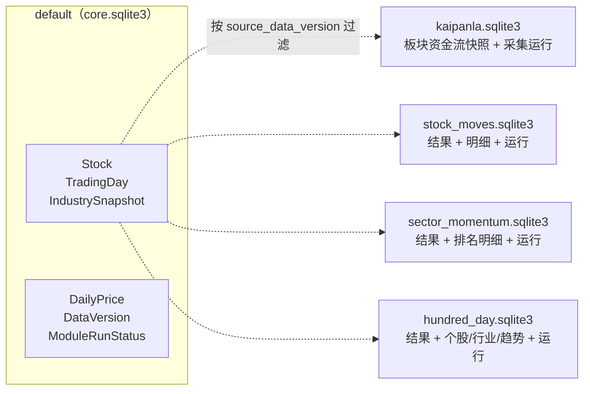
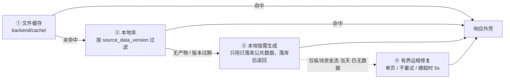
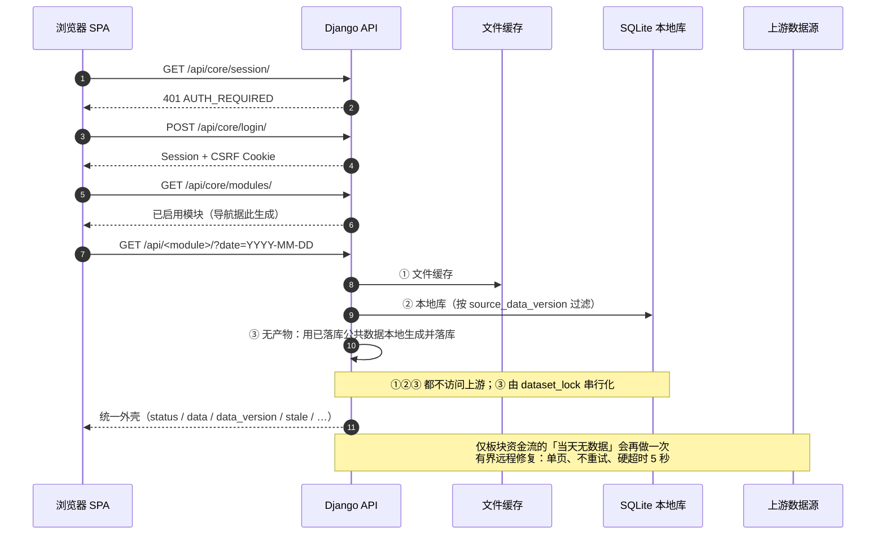
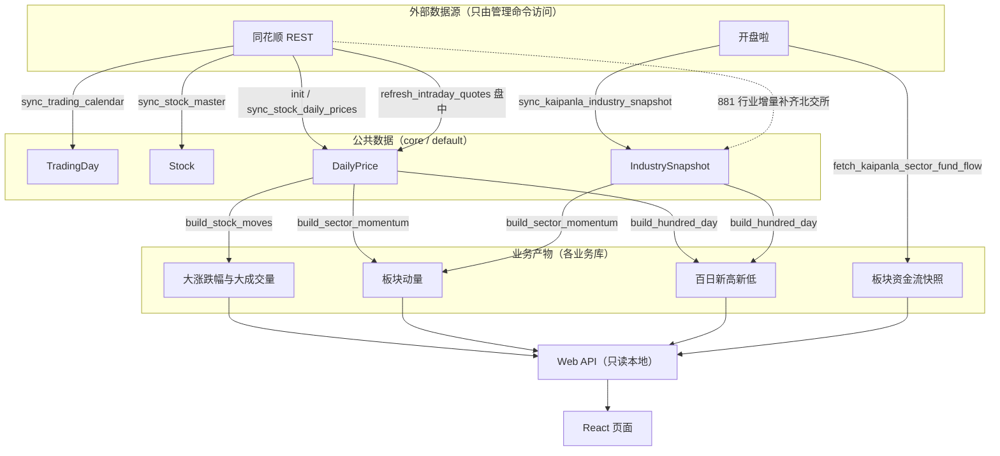
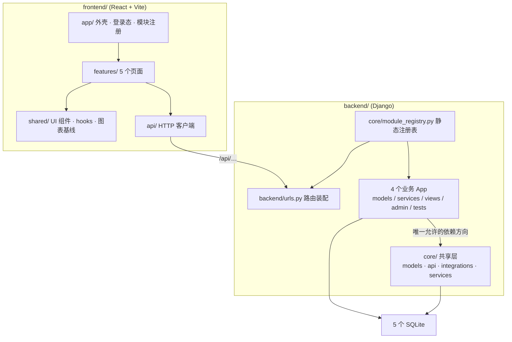

# A 股市场复盘

将「开盘啦板块资金流」和三个盘后结构分析模块整合为一个 **Django + React** 应用：本地 SQLite 落地公共行情与板块关系，管理命令负责采集与计算，Web API 只从本地读，前端只消费 API。

设计上有两条硬边界，全文都围绕它们展开：

1. **业务模块之间零依赖**。四个业务模块通过静态注册表启用，彼此不能互相 import，也不能互相读库；它们只能依赖不可删除的 `core` 共享层。`core` 不反向依赖任何业务模块。
2. **采集与读取分离**。上游数据只由管理命令写入，Web 请求永不触发全市场采集；页面读不到时按「文件缓存 → 本地库 → 用已落库数据本地生成」降级，而不是去上游抓。

---

## 文档导航

| 文档 | 内容 |
| --- | --- |
| **本文件（README）** | 总览：功能 / 数据库 / Web API / 命令 / 工作流 / 代码结构 / 开发与生产运维 / 排查 |
| [`docs/specs/integration-spec.md`](docs/specs/integration-spec.md) | 整合规格：能力地图、数据契约、异常边界、可测试验收标准 |
| [`docs/acceptance/traceability.md`](docs/acceptance/traceability.md) | 规格条款 → 自动化/人工证据的映射矩阵与基线数字 |
| [`docs/ops/deployment.md`](docs/ops/deployment.md) | 部署与运行：`.env` 清单、五个库的迁移、crontab、进程管理、备份回滚 |
| [`docs/ops/manage-commands.md`](docs/ops/manage-commands.md) | `python manage.py` 命令手册：参数、失败语义、日志、故障排查 §10 |
| [`docs/data-sources/web-api.md`](docs/data-sources/web-api.md) | 上游 Web API：开盘啦与同花顺的接口、参数、响应字段、调用示例 |
| [`docs/data-sources/hithink-and-kaipanla-capability.md`](docs/data-sources/hithink-and-kaipanla-capability.md) | 已批准的数据源边界与实测结论 |
| [`docs/ideas/integration.md`](docs/ideas/integration.md) | 合并构想（历史设计输入，保留备查） |
| [`docs/reviews/`](docs/reviews) | 两份代码与复杂度评审报告（含修复记录） |
| [`AGENTS.md`](AGENTS.md) | 仓库协作约定。它由 IDE 在仓库根目录自动加载，故**不放** `docs/` |
| [`tasks/`](tasks) | 计划与待办（不进 `docs/`） |

---

## 1. 功能设计

### 1.1 模块一览

| 模块 | 导航分组 | Django App | API 前缀 | 前端路由 | 数据来源 / 用途 |
| --- | --- | --- | --- | --- | --- |
| 开盘啦 | 板块资金流 | `kaipanla` | `/api/kaipanla/` | `/fund-flow/kaipanla` | 开盘啦板块资金流排行（盘中 5 分钟快照 + 分时历史） |
| 大涨跌幅与大成交量个股 | 盘后结构分析 | `stock_moves` | `/api/stock-moves/` | `/stock-moves` | 本地公共日行情，按上证/深证/北交所分组 |
| 板块动量 | 盘后结构分析 | `sector_momentum` | `/api/sector-momentum/` | `/sector-momentum` | 本地日行情 + 开盘啦行业关系 |
| 百日新高新低占比 | 盘后结构分析 | `hundred_day` | `/api/hundred-day/` | `/hundred-day` | 本地日行情 + 开盘啦行业关系 |

模块定义集中在 `backend/core/module_registry.py`，是唯一来源。`INSTALLED_APPS`、`backend/urls.py` 的路由装配、`/api/core/modules/` 的导航响应三处都由它派生（不手写）；唯一需要人工对齐的是 `.env` 的 `ENABLED_MODULES` —— 少写一个 id 就等于关掉该模块。新增模块还要在 `frontend/src/app/moduleRegistry.js` 补一条「模块 id → 页面组件」映射，否则该页只显示占位内容。

### 1.2 用户流程

1. 未登录访问任意页面 → 前端 `AuthGate` 先请求 `/api/core/session/`，拿到 401 后渲染登录页。
2. 登录成功（`POST /api/core/login/`）→ 请求 `/api/core/modules/`，按返回的 `navigation_group` / `navigation_order` 生成顶栏标签，默认选中第一个模块。
3. 进入任一模块 → 默认请求**不带** `date`，由后端解析「最新完整公共行情日」；用户可用日期控件选出可用的历史交易日。
4. 数据未就绪时页面显示准备中/空状态，**不影响其他模块**：开盘啦被上游 403/429/超时屏蔽是**可接受的独立失败**，保留旧数据，其余模块照常。

### 1.3 关键设计取舍

| 取舍 | 做法 | 原因 |
| --- | --- | --- |
| 读不到数据怎么办 | 本地按需生成派生结果，而不是回源 | 上游是外部系统，页面可用性不能挂在它身上 |
| 派生结果什么时候算 | 请求该日期且本地无产物时当场算 | 避免为每个交易日预跑全量；实现在各模块 `services/read_path.py` |
| 并发重复计算 | `dataset_lock(module_id, dataset_key)` | 同一数据集同一时刻只允许一个执行者，竞争者拿到 409 |
| 关掉一个模块 | `ENABLED_MODULES` 少写一个 id | URL 不挂载、导航不出现；被关模块的前缀统一由 `module_disabled_view` 回答 404 + `MODULE_DISABLED`，不会退化成 Django HTML 404 |

### 1.4 行业口径

行业关系**只有一层，没有父子层级**。全链路统一用开盘啦 `881xxx` 行业族：`.env` 的 `KAIPANLA_INDUSTRY_PARENT_ZS_TYPE` 与 `KAIPANLA_FLOW_ZS_TYPE` 必须都是 `4`（配套 `Type=1`），两处不同族会混族。

北交所股票在开盘啦 881 里用的是旧代码（43/83/87），313 只 `920xxx` 无法归入任何行业；由 `core/services/industry_backfill.py` 用同花顺 881 行业成分股**只增不删**地补齐（开关 `HITHINK_INDUSTRY_BACKFILL_ENABLED`，默认开）。这只是补归属，不改变「行业关系以开盘啦为准」。

---

## 2. 数据库设计

### 2.1 五库布局

`core` 写 `default`，每个业务 App 写自己的同名库；路由由 `backend/backend/db_router.py` 依据模块注册表推导，是恒等映射（app 名 = 库名）。



所有库都是 SQLite，`TIME_ZONE=Asia/Shanghai` 且 `USE_TZ=True`，因此 **DateTimeField 存的是 UTC**，用 sqlite3 直读要 +8 小时才是北京时间；`DateField`（业务日期）按自然日存，不受时区影响。

### 2.2 公共层（`default`）

| 表 | 关键字段 | 说明 |
| --- | --- | --- |
| `Stock` | `thscode`(uniq)、`stock_code`(uniq)、`stock_name`、`exchange`(SH/SZ/BJ)、`is_active` | A 股主数据；退市/停牌只置 `is_active=False`，不删行 |
| `TradingDay` | `trade_date`(uniq) | 交易日历；本地判定 = `chinese-calendar` 周末节假日 → 同花顺日历 |
| `IndustrySnapshot` | `industry_code`(uniq)、`industry_name`、`stock_codes`(JSON) | 行业 → 股票代码列表；一只股票可属多个行业（多重归属） |
| `DailyPrice` | `stock`(FK PROTECT)、`trade_date`、`pre_close` / `open/high/low/close`、`change_percent`、`volume`、`turnover`、`has_valid_trade`、`source_batch_id`、`source_data_version` | 公共前复权日行情，(stock, trade_date) 唯一 |
| `DataVersion` | `dataset_key`、`version`(uniq)、`business_date`、`coverage_start/end_date`、`status`(running/complete/failed)、`expected/actual/missing_record_count`、时间戳、`error_summary` | 数据集版本。只有 `expected==actual && missing==0` 才置 `complete` |
| `ModuleRunStatus` | `module_id`、`dataset_key`、`status`、`completeness`、`business_date`、`source_data_version`、`serving_stale`、`consecutive_failure_count`、`error_summary` | 每模块每数据集的运行态，`/admin/` 与响应外壳的 `stale`/`preparation` 都源于它 |

### 2.3 业务层：统一的「结果 + 明细 + 运行」三段式

四个业务模块的表结构刻意同构，便于横向对照与排障：

| 模块 | 结果表（一天一行） | 明细表 | 运行表 |
| --- | --- | --- | --- |
| `kaipanla` | `KaipanlaSectorFundFlowSnapshot`：`sector_code`、`trade_date`、`snapshot_time`(5 分钟对齐)、`change_pct`、`main_net_inflow`、`main_buy`、`main_sell`、`large_order_net_inflow`、`volume_ratio`、`turnover_amount`、`float/total_market_cap` | 无（每条快照即一行明细，按 `sector_code`+`snapshot_time` 索引） | `KaipanlaSectorFundFlowRun`：`source_batch_id`、`expected/completed_page_count`、`failed_page_offsets`、`expected/actual/missing_record_count` |
| `stock_moves` | `StockMoveResult`：六个分组计数（`sse/szse/bse` × `rise/fall`）、`distinct_stock_count`、`warnings` | `StockMoveItem`：`group`、`rank`、`stock_code/name`、`industries`(JSON)、`change_percent`、`turnover` | `StockMoveRun`：`source_batch_id`、`published_result_id`、`total_candidate_count` |
| `sector_momentum` | `SectorMomentumResult`：`total_market_turnover`、`unmapped_stock_count` | `SectorMomentumRanking`：`metric`、`rank`、`industry_code/name`、`stock_count`、`average_change_percent`、`industry_turnover`、`market_turnover_ratio`、`score`、`stocks`(JSON) | `SectorMomentumRun`：`published_result_id`、`total_market_turnover`、`unmapped_stock_count` |
| `hundred_day` | `HundredDayResult`：`valid_stock_count`、`new_high_count`、`new_low_count` | `HundredDayStockFlag`（`is_new_high` / `is_new_low`）、`HundredDayIndustrySummary`（行业维度计数 + 明细 JSON）、`HundredDayTrend`（`trade_date`、`new_high_ratio`、`new_low_ratio`，供走势图） | `HundredDayRun`：`published_result_id`、`valid_stock_count` |

三段式解决三个具体问题：

- **结果表**是页面一次请求的全部内容，避免每次聚合；
- **运行表**记录「这一天的这个结果是谁在哪次运行里发布出来的」（`published_result_id` / `source_batch_id`），失败重跑不产生孤儿结果；
- **明细表**只保存展示所需的排序切片，不保存全市场中间量。

### 2.4 版本溯源

每个派生结果都存 `source_daily_price_version` 与 `source_industry_version`。读路径按这两个字段过滤：**版本对不上就不返回**，于是「重算输入必须重算产物」这条规则由数据结构强制，而不是靠调用方自觉。增量更新时，受影响的交易日必须整体改归属新版本，否则页面会读不到。

---

## 3. Web API 设计

### 3.1 路由总表

| 方法 | 路径 | 说明 |
| --- | --- | --- |
| `GET` | `/api/core/session/` | 当前登录态；未登录 401 `AUTH_REQUIRED` |
| `POST` | `/api/core/login/` | 登录，成功下发 Session/CSRF Cookie；失败过多 429 `TOO_MANY_ATTEMPTS` |
| `POST` | `/api/core/logout/` | 登出 |
| `GET` | `/api/core/health/` | 健康检查；只记 DEBUG 访问日志 |
| `GET` | `/api/core/modules/` | 已启用模块清单（驱动前端导航） |
| `GET` | `/api/kaipanla/sectors/` | 板块资金流排行；`?date=` |
| `GET` | `/api/kaipanla/sectors/intraday/` | 当天分时（快照时间序列）；`?date=`、`?inflow_top=`/`?outflow_top=`（0–30，默认 5） |
| `GET` | `/api/kaipanla/sectors/intraday/history/` | 历史分时；`?date=`、`?days=`（仅 1/5/10/20，默认 5）、`?inflow_top=`/`?outflow_top=` |
| `GET` | `/api/kaipanla/dates/` | 有数据的交易日列表（无参数） |
| `GET` | `/api/stock-moves/` 与 `/api/stock-moves/dates/` | 结果 / 可用日期 |
| `GET` | `/api/sector-momentum/` 与 `/api/sector-momentum/dates/` | 结果 / 可用日期 |
| `GET` | `/api/hundred-day/` 与 `/api/hundred-day/dates/` | 结果 / 可用日期 |
| `GET` | `/admin/` | Django 后台：查看数据版本、运行状态、各模块数据（**只读状态，不提供在线重跑**） |

三个盘后模块的 `results` 与 `dates` 由同一份 `core/api/read_endpoints.py` 生成，只有文案（以及 `hundred_day` 多一条「历史不足」规则）不同——这是刻意的：三处状态码与错误码不允许各写一套。

### 3.2 统一响应外壳

所有 JSON 端点回答同一个外壳，前端因此只需实现一套状态处理：

```json
{
  "status": "ok",
  "business_date": "2026-09-12",
  "generated_at": "2026-09-12T15:45:03.128452+08:00",
  "data_version": "2026-09-12T15:40:11+08:00-7f3a91",
  "stale": false,
  "source": "database",
  "preparation": { "state": "ready", "retry_after_seconds": null },
  "warnings": [],
  "error": null,
  "data": {}
}
```

| 字段 | 取值 | 前端怎么用 |
| --- | --- | --- |
| `status` | `ok` / `partial`（有 `warnings`）/ `preparing` / `error` | 决定是否展示告警条 |
| `business_date` | 该响应实际所属交易日 | 与用户选择的日期比对，不一致时提示「展示的是 X 日数据」 |
| `generated_at` | 服务端生成时刻（本地时区） | 刷新时间戳展示 |
| `data_version` | 数据的版本标识 | 调试与去重 |
| `stale` | 是否在服务旧产物 | 展示「正在展示旧数据」 |
| `source` | `cache` / `database` / `computed` | 排障时一眼看出走了哪一级：命中文件缓存 / 读本地库 / 本次请求当场算出来 |
| `preparation` | `{state, retry_after_seconds}` | 202 时用它渲染「准备中 + 建议 X 秒后重试」 |
| `warnings` / `error` | 非致命提示 / `{code, message}` | 告警与错误态 |

### 3.3 HTTP 状态与错误码

| HTTP | 语义 | 典型错误码 |
| --- | --- | --- |
| `200` | 有数据（`warnings` 非空时 `status=partial`） | — |
| `202` | 默认入口尚未准备好，可稍后重试 | `DATA_PREPARING` |
| `400` | 参数非法 | `INVALID_DATE`、`INVALID_PARAMETER` |
| `401` | 未登录 | `AUTH_REQUIRED` |
| `403` | CSRF 校验失败 | `CSRF_FAILED` |
| `404` | 显式指定日期却无该日数据；模块未启用 | `DATA_NOT_AVAILABLE`、`MODULE_DISABLED` |
| `409` | 该数据集正被其他任务占用 | `SYNC_IN_PROGRESS` |
| `429` | 登录尝试过于频繁 | `TOO_MANY_ATTEMPTS` |
| `503` | 上游/缓存不可用或数据不完整 | `UPSTREAM_UNAVAILABLE`、`UPSTREAM_RATE_LIMITED`、`DATA_INCOMPLETE`、`CACHE_CORRUPTED`、`INSUFFICIENT_HISTORY` |

全部错误码定义在 `core/api/errors.py` 的 `ErrorCode`（共 14 个）。**202 与 404 的分界线是「请求是否显式带了 `date`」**：带 `date` 说明调用方点名要这一天，不能拿别的日期糊弄过去，只能是 404；不带 `date` 说明是默认入口，还没算出来就是 202。两侧判定必须一致——路由层看 `'date' in request.GET`，读路径看 `requested_explicitly`。

### 3.4 读取与轻量修复顺序



- ①②③ 都不访问上游，所以**页面响应只受本地数据与本地算力限制**；③ 由 `dataset_lock` 串行化，竞争者得到 409 或（默认入口时）旧数据 + `stale=true`。
- ④ 是唯一的回源路径，只服务板块资金流的「当天还没有数据」这一种情况；它由 `REMOTE_REPAIR_ENABLED` 与 `REMOTE_REPAIR_HARD_TIMEOUT_SECONDS`（默认 5 秒，会收窄 `KAIPANLA_TIMEOUT_SECONDS`）两个开关控制，一次最多发一次抓取。
- 全市场初始化（`init_stock_daily_prices`）**永远不能**出现在 Web 请求路径里。

---

## 4. 后端命令设计

10 个管理命令，全部从 `backend/` 目录执行。前 6 个是 `core`（公共数据），后面 4 个是业务模块。

| 命令 | 归属 | 读上游 | 日期语义 | 幂等 / 可重跑 |
| --- | --- | --- | --- | --- |
| `sync_trading_calendar` | core | 同花顺 | 全量日历 | 幂等，重复只做增量 |
| `sync_stock_master` | core | 同花顺 | 全量清单 | 幂等；带行数下界保护，上游截断会失败而非静默停用全市场 |
| `sync_kaipanla_industry_snapshot` | core | 开盘啦 + 同花顺（补齐） | `.env` 的 `KAIPANLA_INDUSTRY_DATE`（空 = 最近交易日） | 幂等，只增不删；补齐开关关掉且同花顺不可用会**整体失败** |
| `init_stock_daily_prices --years N` | core | 同花顺 | 以执行日为终点的最近 N 年 | **不是一次性命令**：可重跑，逐条比对只写差异行；`--dry-run` 先报告将改动多少行，全一致时输出 `no changes` |
| `sync_stock_daily_prices --date YYYY-MM-DD` | core | 同花顺 | **必填**，只同步当天 | 幂等；绝不扩大为全量历史抓取 |
| `refresh_intraday_quotes [--date]` | core | 同花顺（实时快照） | 默认今天（Asia/Shanghai） | 幂等；与上一命令同一数据集、同一字段语义，收盘后由历史接口为权威覆盖 |
| `fetch_kaipanla_sector_fund_flow [--latest] [--dry-run]` | kaipanla | 开盘啦 | 盘中自动；午休/盘后/非交易日须加 `--latest` | 只发布**完整**快照（缺页即整体失败）；同一 `(sector_code, snapshot_time)` 有唯一约束，重复抓取是覆盖而非追加 |
| `build_stock_moves --date YYYY-MM-DD` | stock_moves | **否** | 必填 | 只读本地公共数据；可重跑 |
| `build_sector_momentum --date YYYY-MM-DD` | sector_momentum | **否** | 必填 | 同上 |
| `build_hundred_day --date YYYY-MM-DD` | hundred_day | **否** | 必填 | 同上 |

通用约定（详见 [`docs/ops/manage-commands.md`](docs/ops/manage-commands.md)）：

- **失败即非零退出**并记录 `ModuleRunStatus`；不删除旧数据、不主动失效缓存、不发送外部通知。
- **锁**：同一数据集同时只允许一个执行者，后来者报 `SYNC_IN_PROGRESS` 退出（不是排队等待）。
- **公共数据 → 派生结果**：`build_*` 三个命令读的是公共 `DailyPrice` / `IndustrySnapshot`，因此必须**先**同步公共数据再构建；重算公共数据后旧产物会自动过期（`source_*_version` 不匹配），页面上表现为「正在展示旧数据」，重新执行 `build_*` 即修复。
- **时区**：命令内部一律用 `Asia/Shanghai` 判交易日；crontab 里生成的日期也必须是上海时区的当天。

---

## 5. 代码角度的前后端工作流

### 5.1 一次页面请求的完整链路



轮询策略与上面这条链路是配套的：资金流页在交易时段每 5 分钟重取，其余三页每 30 分钟；非交易时段与手选历史日期不轮询。判断「现在是否交易时段」由前端 `shared/marketSession.js` 与后端交易日历各自独立完成，前端只是降噪，不作为正确性依据。

### 5.2 采集侧工作流（命令 ↔ 页面）



要点：**虚线是唯一的跨源补齐**（同花顺只补北交所行业归属，不改变「行业关系以开盘啦为准」）；`build_*` 三个命令**看不到上游**，箭头只从本地表出发。任何「页面触发了上游抓取」的设计都是错的——除了 3.4 节那个有界的当天修复。

### 5.3 状态码在两侧的对应

| 场景 | 后端 | 前端表现 |
| --- | --- | --- |
| 有数据 | `200` | 渲染内容 + `generated_at` 刷新戳 |
| 有数据但服务旧产物 | `200` + `stale=true` | 内容上叠加「正在展示旧数据」提示 |
| 默认入口尚未生成 | `202 DATA_PREPARING` | 空状态 + 「准备中」+ 建议重试间隔 |
| 显式日期无数据 | `404 DATA_NOT_AVAILABLE` | 空状态，**不改用其他日期** |
| 数据集被占用 | `409 SYNC_IN_PROGRESS` | 短暂提示后可重试 |
| 会话失效 | `401 AUTH_REQUIRED` | 客户端统一回调 → 回到登录页 |
| 模块被关闭 | `404 MODULE_DISABLED` | 该标签本就不会出现（导航由 `/modules/` 生成） |

---

## 6. 代码结构

### 6.1 依赖方向



`backend/backend/tests/test_module_isolation.py` 用导入图守卫这条方向：业务模块之间不能互相 import，`core` 不能 import 任何业务模块。**唯一的例外是 `core/api/errors.py` 的异常→错误码映射在业务模块里有一份等价拷贝**——因为共享层不允许反向依赖，这份重复是刻意保留的。

### 6.2 目录职责

| 路径 | 职责 |
| --- | --- |
| `backend/backend/` | `settings.py`（含模块驱动的 `INSTALLED_APPS`）、`urls.py`、`db_router.py`、`env.py`（`.env` 读取 + 5 秒 TTL 缓存） |
| `backend/core/models/` | `market.py`（主数据）与 `datasets.py`（公共行情 + 版本 + 运行态） |
| `backend/core/api/` | `responses.py`（统一外壳）、`errors.py`（错误码）、`validators.py`、`read_endpoints.py`（三个盘后模块共用的两端点） |
| `backend/core/integrations/` | `hithink/`、`kaipanla/` 两个上游客户端；**只有这里出现 `requests`**，且只被管理命令/服务调用 |
| `backend/core/services/` | 日历、市场数据、发布、锁、文件缓存、行业补齐、盘中刷新、读路径等共享服务 |
| `backend/core/management/commands/` | 6 个公共数据命令 |
| `backend/<module>/{models,services,views,admin,migrations,tests}.py` | 业务模块自成一体的四件套；`services/` 内部分 `analysis.py`（纯计算）、`writer.py`（落库）、`read_path.py`（读与按需生成）、`source_data.py`/`source_versions.py`（版本解析） |
| `backend/<module>/management/commands/` | 该模块的构建/采集命令 |
| `frontend/src/app/` | `AuthGate.jsx`、`LoginPage.jsx`、`moduleRegistry.js`（后端模块 → 前端组件/导航的映射） |
| `frontend/src/features/` | `kaipanla`、`sector-flow`、`stock-moves`、`sector-momentum`、`hundred-day` 五个页面及其数据 hook |
| `frontend/src/shared/ui/` | `ModulePage`、`Panel`、`DatePicker`、`RankItem`、`TabBar`、`Icon` 等 |
| `frontend/src/shared/charts/` | `chartTheme.js` 图表基线：只导出四个业务图实际消费的 5 个符号，且**不 import echarts**（测试只 mock `init`） |
| `frontend/src/styles/` | `tokens.css` 设计令牌（配色、间距、字号唯一来源） |
| `scripts/` | `check_module_matrix.sh`（单模块隔离矩阵）、`intraday_orchestrator.sh` + 两个安装脚本 |
| `tests/` | 临时探针/脚本产物目录，用完清理（不进版本库） |

### 6.3 各层测试与基线

| 范围 | 命令 | 最近一次基线 |
| --- | --- | --- |
| 后端全量 | `cd backend && python manage.py test` | 399 个测试，`OK (skipped=1)` |
| 模块隔离矩阵 | `./scripts/check_module_matrix.sh` | 不访问上游，逐个单独启用模块跑通 |
| 前端单测 | `cd frontend && npm test -- --run` | 19 个文件 / 153 个测试 |
| 前端静态检查 | `npm run lint`（`--max-warnings=0`） | 0 warning |
| 前端构建 | `npm run build` | 产出 `frontend/dist/` |

---

## 7. 开发环境运维

### 7.1 起步

```bash
# 0. 在 backend/ 建虚拟环境并安装依赖
cd backend
python -m venv .venv && . .venv/bin/activate
pip install -r requirements.txt

# 1. 回仓库根：配置与运行时目录都相对仓库根
cd ..
cp .env.example .env
mkdir -p backend/data backend/data/locks backend/cache backend/logs

# 2. 建库（五库按顺序迁移；可重复执行）
cd backend
python manage.py migrate --database=default
python manage.py migrate --database=kaipanla
python manage.py migrate --database=stock_moves
python manage.py migrate --database=sector_momentum
python manage.py migrate --database=hundred_day
python manage.py check
python manage.py createsuperuser
```

首次数据准备按依赖顺序执行一次：

```bash
python manage.py sync_trading_calendar
python manage.py sync_stock_master
python manage.py sync_kaipanla_industry_snapshot
python manage.py init_stock_daily_prices --years 1
```

### 7.2 前后端联调

```bash
# 终端 1
cd backend && python manage.py runserver 127.0.0.1:8000
# 终端 2
cd frontend && npm install && npm run dev
```

浏览器访问 Vite 的地址（默认 `http://localhost:5173`），它把 `/api/` 代理到根目录 `.env` 的 `VITE_DEV_BACKEND_ORIGIN`（默认 `http://127.0.0.1:8000`）。本地纯 HTTP 需要在 `.env` 里放宽 cookie：

```dotenv
VITE_DEV_BACKEND_ORIGIN=http://127.0.0.1:8000
CSRF_TRUSTED_ORIGINS=http://localhost:5173
SESSION_COOKIE_SECURE=false
CSRF_COOKIE_SECURE=false
```

**这四行绝不能进生产**。生产由 HTTPS 反向代理把前端与 `/api/` 放在同一域名下，两项 `*_COOKIE_SECURE` 必须保持 `true`。

### 7.3 测试姿势（重要）

```bash
# 后端：先清锁与缓存，再跑，输出重定向到文件后过滤
rm -f backend/data/locks/*.lock && rm -rf backend/cache/*
cd backend && CODEBUDDY_SAFE_DELETE_ENABLED=0 python manage.py test > ../tests/_backend.txt 2>&1
grep -E "^(FAIL|ERROR):" ../tests/_backend.txt

# 前端
cd frontend && npm test -- --run && npm run lint && npm run build
```

**不要把 `manage.py test` 放进管道再挂 `head`**：SIGPIPE 会中断测试进程并留下一批锁文件，下一次运行会连锁报出几十个 ERROR，看起来像大规模回归。同理，测试前不清锁会拿到假失败。

### 7.4 配置生效时机

`backend/backend/env.py` 读取仓库根目录 `.env`，带 5 秒 TTL + 指纹缓存：

- **运行期读取**的项（上游凭据、超时、开关）→ 长驻进程最多 5 秒后生效，**不必重启**；
- **启动时读取**的项（`DJANGO_SECRET_KEY`、`DJANGO_DEBUG`、`DJANGO_ALLOWED_HOSTS`、`ENABLED_MODULES`、五个数据库路径）→ **必须重启服务**；
- crontab 里的管理命令每次都是新进程，一律立即生效。

### 7.5 模块开关与隔离验证

```bash
# 从仓库根执行；脚本自己对四个模块各跑一遍「core + 单个业务模块」的配置检查与迁移路由检查
PYTHON_BIN=<venv-python> ./scripts/check_module_matrix.sh
```

脚本内部对每个模块设置 `ENABLED_MODULES=<module>` 再跑 `manage.py check` 与 `migrate --plan`，因此不需要（也不要）在外面传 `ENABLED_MODULES`。它不访问上游；只有在已获批的环境里才用 `RUN_UPSTREAM_DRY_RUNS=1` 打开上游试跑。

`ENABLED_MODULES` 解析为空会**在启动时抛 `ImproperlyConfigured`**——这是故意的：空配置会让 `INSTALLED_APPS` 与路由同时丢掉全部业务模块，页面全 404 而启动不报错，属于必须在部署阶段炸出来的错误。

---

## 8. 生产环境运维

本文只给最小可上线集合；完整的 `.env` 清单、备份与回滚流程见 [`docs/ops/deployment.md`](docs/ops/deployment.md)。

### 8.1 进程管理（gunicorn + systemd）

`gunicorn` 不在 `requirements.txt` 里（本地开发用 `runserver`，用不着），生产单独安装：

```bash
pip install gunicorn
```

```ini
# /etc/systemd/system/market-review.service
[Unit]
Description=A-share market review (Django + gunicorn)
After=network.target

[Service]
Type=simple
User=www-data
WorkingDirectory=/srv/<deploy-dir>/backend
ExecStart=/srv/<deploy-dir>/.venv/bin/gunicorn backend.wsgi:application \
    --bind 127.0.0.1:8000 --workers 2 --timeout 60
Restart=always
RestartSec=5

[Install]
WantedBy=multi-user.target
```

```bash
systemctl daemon-reload
systemctl enable --now market-review.service
systemctl status market-review.service
```

三条不能省的理由：

- **绑 `127.0.0.1` 而不是 `0.0.0.0`**：Django 不直接暴露公网，对外只经反向代理。
- **`--timeout` 必须大于三个盘后模块「本地按需生成」的耗时**（通常几秒），否则一次生成会被 worker 超时杀掉。
- **`--workers 2` 足够**：单机 SQLite 部署，worker 越多写锁竞争越明显；真正耗时的工作都在 crontab 的管理命令里。

不需要给 systemd 配 `EnvironmentFile`：`backend/backend/env.py` 自己读仓库根的 `.env`。

### 8.2 Nginx 配置示例

```nginx
# /etc/nginx/conf.d/market-review.conf

# 1) HTTP 全量跳 HTTPS
server {
    listen 80;
    listen [::]:80;
    server_name review.example.com;

    # 证书续期质询等例外路径可按需在此放行；其余一律跳转
    location /.well-known/acme-challenge/ {
        root /var/www/acme;
    }
    location / {
        return 301 https://$host$request_uri;
    }
}

# 2) HTTPS 主站：静态站点 + /api/ /admin/ 反代
server {
    listen 443 ssl;
    listen [::]:443 ssl;
    http2 on;   # nginx ≥ 1.25.1 的写法；更早版本改为 `listen 443 ssl http2;`
    server_name review.example.com;

    ssl_certificate     /etc/letsencrypt/live/review.example.com/fullchain.pem;
    ssl_certificate_key /etc/letsencrypt/live/review.example.com/privkey.pem;
    ssl_protocols       TLSv1.2 TLSv1.3;
    ssl_prefer_server_ciphers off;

    # 与 DJANGO_ALLOWED_HOSTS / CSRF_TRUSTED_ORIGINS 保持同一个域名
    add_header Strict-Transport-Security "max-age=31536000; includeSubDomains" always;
    add_header X-Content-Type-Options    "nosniff" always;
    add_header X-Frame-Options           "DENY" always;
    add_header Referrer-Policy           "strict-origin-when-cross-origin" always;

    charset utf-8;
    client_max_body_size 2m;

    # 3) 前端构建产物
    root /srv/<deploy-dir>/frontend/dist;
    index index.html;

    # Vite 产物带内容哈希，可长缓存。
    # 注意：location 里一旦出现 add_header，就会**丢掉** server 级继承来的全部
    # add_header（见 §9.2）。若要保留上面的安全响应头，这里应把安全头一并重复，
    # 或改用 include 一个公共 snippet。
    location /assets/ {
        expires 1y;
        add_header Cache-Control "public, immutable";
        try_files $uri =404;
    }

    # 4) Django 管理后台静态文件
    #    注意：settings.py 目前没有 STATIC_ROOT。部署前必须二选一：
    #    a) 补上 STATIC_ROOT 并执行 collectstatic --noinput，然后把 alias 指过去；
    #    b) 或临时 alias 到虚拟环境内的 admin 静态目录（升级 Django 后需复查）。
    location /static/ {
        alias /srv/<deploy-dir>/backend/staticfiles/;
        expires 30d;
        access_log off;
    }

    # 5) API 反代
    location /api/ {
        proxy_pass         http://127.0.0.1:8000;
        proxy_http_version 1.1;
        proxy_set_header   Host              $host;
        proxy_set_header   X-Real-IP         $remote_addr;
        proxy_set_header   X-Forwarded-For   $proxy_add_x_forwarded_for;
        proxy_set_header   X-Forwarded-Proto $scheme;   # 生产必须，否则 Django 认为是 HTTP
        # 读路径可能触发一次本地按需生成（几秒），超时要给足
        proxy_read_timeout 120s;
        proxy_send_timeout 120s;
    }

    # 6) 管理后台
    location /admin/ {
        proxy_pass         http://127.0.0.1:8000;
        proxy_http_version 1.1;
        proxy_set_header   Host              $host;
        proxy_set_header   X-Real-IP         $remote_addr;
        proxy_set_header   X-Forwarded-For   $proxy_add_x_forwarded_for;
        proxy_set_header   X-Forwarded-Proto $scheme;
    }

    # 7) SPA 路由回退：除上面几条外的路径都交给 index.html
    #    少了这一条，用户刷新 /stock-moves 会 404
    location / {
        try_files $uri $uri/ /index.html;
    }
}
```

上线后自查：`nginx -t` → `systemctl reload nginx` → 用 `https://域名/api/core/health/` 验证反代链路 → 登录走一遍 `session/` → `login/` 确认 cookie 正常下发（`Secure` + `SameSite`）。

### 8.3 采集调度

盘后管线（四组 crontab）与可选盘中链路（`scripts/intraday_orchestrator.sh` + launchd/cron 安装脚本）都在 [`docs/ops/deployment.md`](docs/ops/deployment.md) §6 与 [`docs/ops/manage-commands.md`](docs/ops/manage-commands.md) §9。

**安装 crontab / launchd 必须由系统所有者在自己的登录会话里执行**：macOS 的 `crontab` 受 TCC 保护（非交互 shell 报 `Operation not permitted`），`launchctl bootstrap` 也只接受来自用户登录会话的装载。

### 8.4 备份与回滚

本期**没有**自动备份、自动归档、自动清理与外部通知。升级或迁移前：停掉对应 crontab 行 → 手动复制 `backend/data/`、`backend/cache/`、`.env`（存到安全位置）与反向代理配置 → 恢复时停服务与 crontab、还原文件、跑 `python manage.py check` 再启动。若迁移不可逆，用部署前备份的对应 SQLite 文件恢复；`core` 与其余模块可独立运行，**不要删除 `core`**。

---

## 9. 关键问题、易踩坑与疑难排查

### 9.1 必须知道的设计约束（踩了就是 bug）

| # | 约束 | 违反后的症状 |
| --- | --- | --- |
| 1 | 模块只在 `module_registry.py` 声明一次；`.env` 的 `ENABLED_MODULES` 必须与它对齐（`INSTALLED_APPS`、路由装配、`/modules/` 导航三处都由注册表派生，不手写） | 页面 404 / 导航少项 / 启动即 `ImproperlyConfigured` |
| 2 | 业务模块只能依赖 `core`，不能互相依赖 | `check_module_matrix.sh` 与 `test_module_isolation.py` 直接失败 |
| 3 | 行业族只能用一个：`KAIPANLA_INDUSTRY_PARENT_ZS_TYPE == KAIPANLA_FLOW_ZS_TYPE == 4` | 混族：行业归属与资金流板块对不上，且 upsert 不删旧族，必须整体重算 |
| 4 | `source_*_version` 必须与派生结果一致 | 重算公共数据后页面显示「正在展示旧数据」或读不到 |
| 5 | 增量更新时受影响的交易日必须整体改归属新版本 | 该日数据读不出来 |
| 6 | 判定「显式日期」的两侧口径必须一致（`'date' in request.GET` ↔ `requested_explicitly`） | 有时 404 有时 202，行为不可预期 |
| 7 | 管理命令用 `Asia/Shanghai` 判交易日；crontab 生成日期也用上海时区 | 跨零点/跨时区时同步到错误的交易日 |
| 8 | 全市场初始化（`init_stock_daily_prices`）不得进 Web 请求或定时任务 | 单个请求变成几千次上游调用 |
| 9 | `build_*` 必须先有公共数据（`DailyPrice` / `IndustrySnapshot`） | 派生命令报「源数据版本不可用」 |
| 10 | 不要给派生结果预跑全量日期；读路径会按需生成 | 无谓的上游全量请求与落库膨胀 |
| 11 | 前端配色必须走 `tokens.css` 的 CSS 变量；图表配色走 `chartTheme.js` 内部基线，不在页面里硬编码色值 | 暗色/亮色与图表主题漂移 |
| 12 | 改 `chartTheme.js` 的导出面要同步改 `chartTheme.test.js` 的导入 | 测试因未定义符号失败 |

### 9.2 常见易踩坑（工程层面）

| 坑 | 正确做法 |
| --- | --- |
| macOS BSD `grep` 里 `"a\|b"` 静默不匹配（`\|` 不成交替） | 一律用 `grep -E "a|b"` |
| 临时预览服务用 `(npx vite &)` 起，命令结束即被回收 → Chrome `ERR_CONNECTION_REFUSED` 且不退出 | 用后台任务方式启动，先 `curl` 确认 200 再截图；**永远不要 `pkill -f "Google Chrome"`** |
| 探针脚本放 `/tmp`（会遮蔽标准库 `inspect`） | 统一放仓库内 `tests/`，用完删除 |
| 同一文件多次 `Edit` 并行提交互相回滚（已复现多次） | 串行编辑；写完用检索复查目标字符串是否真的消失，**不要凭工具返回的 "successfully" 判断落盘** |
| `Edit` 在 `old_string` 漏掉尾随换行时会把装饰器吃进函数体 | 改测试前先重读目标区域 |
| 跑全量后端测试不清锁、还挂 `head` | 见 §7.3：先清锁与缓存，重定向到文件后再过滤 |
| `npx eslint -f compact` 在 ESLint 9 上失败 | 去掉 `-f compact` |
| 用 AST 扫描找死代码会得到约百条误报（Django 的字符串/发现式引用） | 逐个人工确认存活，不要批量删除 |
| Nginx：`location` 里写了 `add_header` 会**丢掉** `server` 级继承的全部 `add_header` | 安全响应头要么在每个 location 重复，要么 `include` 一个公共 snippet |
| `STATIC_URL='static/'` 看起来少了前导斜杠 | 运行时会被规范化为 `/static/`，**不是 bug**；真正缺的是 `STATIC_ROOT` |

### 9.3 症状 → 排查表

| 症状 | 先查哪里 | 常见原因 |
| --- | --- | --- |
| 页面全空、导航也不出现 | `GET /api/core/modules/` 响应；`.env` 的 `ENABLED_MODULES` | 模块没启用；或配置成空列表导致启动失败 |
| 页面显示「准备中」（202） | 该日的 `ModuleRunStatus` 与 `DataVersion` | 默认入口当天还没算；执行对应的 `build_*`，或等待盘中链路刷新 |
| 显示「正在展示旧数据」 | 响应里的 `stale`/`source`；派生结果的 `source_data_version` | 公共数据重算后没重跑 `build_*` |
| 显式选日期后 404 | 该日 `DailyPrice` 是否 `complete` | 该日没有完整公共行情；先 `sync_stock_daily_prices --date` |
| 报「源数据版本不可用」 | 公共数据是否先于 `build_*` 完成 | 同 9.1 第 8/9 条 |
| 409 `SYNC_IN_PROGRESS` | 是否已有同数据集的命令在跑 | 等它结束；确认没有残留锁文件 |
| 命令报锁已被占用但没人跑 | `backend/data/locks/*.lock` | 上次被 SIGKILL 留下的陈旧锁 |
| 开盘啦板块资金流 403/429/超时 | 上游可用性；`KAIPANLA_*` 凭据与超时 | 上游屏蔽属**可接受失败**：保留旧数据，其余模块不受影响 |
| 同花顺 4001 / 429 | `HITHINK_FINANCE_REQUEST_DELAY_SECONDS`、`MAX_RETRIES` | 频率过高：加大请求间隔 |
| 个股全都不见了（`sync_stock_master` 之后） | 上游返回条数；命令是否报失败 | 行数下界保护触发：上游截断，重跑一次 |
| 北交所股票没有行业 | `HITHINK_INDUSTRY_BACKFILL_ENABLED`；同花顺 881 接口可用性 | 补齐开关关闭或同花顺不可用（此时命令会整体失败，不会静默退回旧状态） |
| 日期显示差一天 | 是否直接用 sqlite3 读了 `DateTimeField` | 存的是 UTC，+8 小时才是北京时间 |
| 前端图表主题不对 | `tokens.css`、`chartTheme.js` 的导出符号 | 绕过设计令牌硬编码了颜色 |
| 刷新非根路径 404 | 反向代理是否配了 `try_files … /index.html` | 缺 SPA 路由回退 |
| 登录后立刻掉线 | `SESSION_COOKIE_SECURE` / `CSRF_TRUSTED_ORIGINS` / `X-Forwarded-Proto` | HTTPS 反代下 cookie 被拒或来源不匹配 |

更细的命令级排查（含每个错误码的处置）见 [`docs/ops/manage-commands.md`](docs/ops/manage-commands.md) §10。

---

## 许可与备案

页面页脚展示备案号；数据来源与使用须遵守上游服务条款，各模块 URL 前缀与启停由 `ENABLED_MODULES` 控制。
