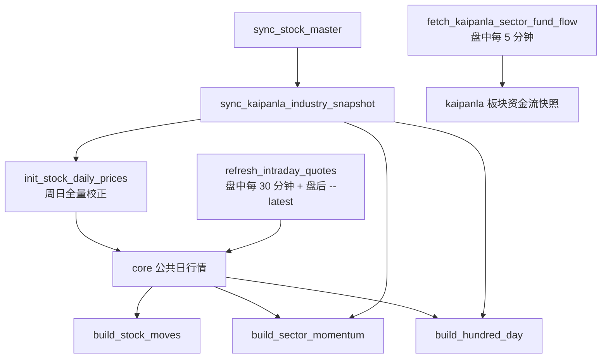

# `python manage.py` 命令使用手册

> 这份运维手册面向本地开发机与阿里云部署机，说明本项目实际注册的 Django 管理命令、依赖关系、执行顺序和故障处理方法。
>
> 命令清单以 `python manage.py help` 的实际输出为准：当前共 **8 个自定义命令**，分布在 `core` / `kaipanla` / `stock_moves` / `sector_momentum` / `hundred_day` 五个 app 下。手册与代码不一致时以代码为准，并回来更新本手册。
>
> 示例统一假设已进入 `<repo>/backend`（仓库根的 `backend/` 子目录）。**管理命令必须在 `backend/` 下执行** —— 配置和数据库路径都相对它解析；`<repo>` 只出现在 `scripts/`、日志和部署路径的示例里。

## 目录

- [1. 当前命令与模块范围](#1-当前命令与模块范围)
- [2. 运行前准备](#2-运行前准备)
- [3. 通用约定](#3-通用约定)
- [4. 首次部署与数据初始化](#4-首次部署与数据初始化)
- [5. 公共基础数据命令（`core`）](#5-公共基础数据命令core)
- [6. 开盘啦板块资金流命令（`kaipanla`）](#6-开盘啦板块资金流命令kaipanla)
- [7. 盘后派生分析命令](#7-盘后派生分析命令)
- [8. Django 运维与诊断命令](#8-django-运维与诊断命令)
- [9. 推荐的 crontab 执行策略](#9-推荐的-crontab-执行策略)
- [10. 常见错误、恢复与排查](#10-常见错误恢复与排查)
- [11. 数据库与缓存](#11-数据库与缓存)
- [12. 命令速查表](#12-命令速查表)

---

## 1. 当前命令与模块范围

当前仓库已注册以下四个业务模块，以及一个不可删除的公共基础库 `core`：

| 模块 | Django App | 数据库 | 与命令有关的职责 |
| --- | --- | --- | --- |
| 公共基础库 | `core` | `backend/data/core.sqlite3` | 股票主数据、开盘啦行业—股票关系、公共日行情；交易日由本地 `chinese-calendar` 推导，不落库。 |
| 开盘啦板块资金流 | `kaipanla` | `backend/data/kaipanla.sqlite3` | 采集开盘啦板块资金流快照（单表，写行即可读）。 |
| 大涨跌幅与大成交量个股 | `stock_moves` | `backend/data/stock_moves.sqlite3` | 从本地公共日行情构建上证/深证/北交所各自的涨跌两组，共六组。 |
| 板块动量 | `sector_momentum` | `backend/data/sector_momentum.sqlite3` | 从本地公共日行情和板块关系构建板块动量排名。 |
| 百日新高新低占比 | `hundred_day` | `backend/data/hundred_day.sqlite3` | 从本地公共日行情和板块关系构建百日新高、新低结果。 |

### 1.1 命令清单

`python manage.py help` 当前发现 8 个自定义命令。按"是否访问上游"与"日常节奏"分三类，全表如下：

| 命令 | App | 访问上游 | 日常节奏 | 一句话职责 |
| --- | --- | --- | --- | --- |
| `sync_stock_master` | `core` | 是 | 按需 | 全量 A 股清单，是所有日行情命令的输入 |
| `sync_kaipanla_industry_snapshot` | `core` | 是 | 按需 / 低频 | 行业—股票关系快照 |
| `init_stock_daily_prices` | `core` | 是 | 每周日一次全量校正 | 最近一年日行情，幂等，重跑只写差异行 |
| `refresh_intraday_quotes` | `core` | 是 | 每交易日盘中每 30 分钟 + 盘后 15:35 定稿 | 当天日行情，**唯一的日常写入者** |
| `fetch_kaipanla_sector_fund_flow` | `kaipanla` | 是 | 每交易日盘中每 5 分钟 | 板块资金流快照（单表） |
| `build_stock_moves` | `stock_moves` | 否 | 每次日行情取数成功后 | 大涨跌幅与大成交量个股 |
| `build_sector_momentum` | `sector_momentum` | 否 | 每次日行情取数成功后 | 板块动量排名 |
| `build_hundred_day` | `hundred_day` | 否 | 每次日行情取数成功后 | 百日新高新低占比 |

**8 个命令里只有 3 个完全不访问上游**：5 个采集命令都打上游，三个 `build_*` 的输入只有本地 `core` 库。把 `build_*` 当采集命令排进 crontab 的高频位是常见误解 —— 它们做的是本地重算，跑密了只是重复劳动。

### 1.2 命令之间的依赖顺序



三条硬规则（后面各节会反复引用）：

1. **公共日行情是三个 `build_*` 的唯一闸门**：当天没有日行情，三个命令都会失败（原文 `No daily prices are stored for ...`），而不是产出空结果。这也是 crontab 里把取数与 `build_*` 用 `&&` 串联的原因 —— 取数失败时接着跑 `build_*`，只是把同一份旧输入再算一遍。
2. **`build_sector_momentum` 与 `build_hundred_day` 额外依赖行业快照**（`sync_kaipanla_industry_snapshot`）；`build_stock_moves` 只依赖日行情。
3. **板块资金流是独立链路**：它只写自己那张表，与公共日行情、与三个 `build_*` 都没有依赖关系，可以独立调度、独立失败。

### 1.3 当前未注册的命令

当前代码库**没有** `fetch_eastmoney_sector_fund_flow` 或其他东方财富管理命令，也没有独立的 `eastmoney` Django App。因此本手册不会提供不存在的东方财富命令示例。待该模块实际实现并注册命令后，应同步补充本手册。

### 1.4 数据源实现提示

当前实现中的股票主数据和前复权日行情命令读取 `HITHINK_FINANCE_*` 配置，并且命令帮助明确标注为 Hithink REST 数据源；开盘啦资金流和行业关系读取 `KAIPANLA_*` / `KPL_*` 配置。请以仓库当前实现和根目录 `.env.example` 为配置依据；不要在命令行、crontab 或日志中写入 API Key、Token 等真实凭据。

---

## 2. 运行前准备

### 2.1 进入后端目录并准备 Python 环境

**仓库不自带虚拟环境**，`.venv/` 也不在版本库里 —— 需要在首次部署时自行创建，并在 `backend/` 下安装 `requirements.txt`（完整步骤见 `deployment.md` §1）。之后每次操作先进入 `backend/`：

```bash
cd <repo>/backend
```

两种等效的调用姿势，选一种并保持一致：

```bash
# 姿势一：先激活虚拟环境，再用裸 python
source /path/to/venv/bin/activate
python --version
python manage.py check

# 姿势二：不激活，直接写解释器绝对路径
/path/to/venv/bin/python manage.py check
```

**本手册示例统一写作 `python manage.py`**，等价于姿势二里那个绝对路径的解释器。但 **crontab 与 shell 脚本里绝不能写裸 `python`**：cron 的 `PATH` 很窄，命中的很可能是没装依赖的系统解释器，表现为 `ModuleNotFoundError: No module named 'django'`。所以 crontab 与 shell 脚本里一律写解释器的绝对路径（完整 crontab 见 [`deployment.md`](deployment.md) §6）。

### 2.2 根目录 `.env`

所有运行时配置均从仓库根目录 `.env` 加载。首次部署时：

```bash
cd <repo>
cp .env.example .env
chmod 600 .env
```

至少确认以下类别已经按环境填写：

| 类别 | 关键变量 | 用途 |
| --- | --- | --- |
| Django | `DJANGO_SECRET_KEY`、`DJANGO_DEBUG`、`DJANGO_ALLOWED_HOSTS`、`DJANGO_TIME_ZONE` | Django 安全和时区。生产必须 `DJANGO_DEBUG=false`。 |
| SQLite | `CORE_DATABASE_PATH`、`KAIPANLA_DATABASE_PATH`、`STOCK_MOVES_DATABASE_PATH`、`SECTOR_MOMENTUM_DATABASE_PATH`、`HUNDRED_DAY_DATABASE_PATH` | 五个数据库文件的位置。 |
| 缓存/锁 | `FILE_CACHE_DIRECTORY`、`LOCK_DIRECTORY`、`FILE_CACHE_*` | API 文件缓存与数据集互斥锁。请求侧没有任何远程兜底开关：读路径不访问上游。 |
| 股票公共数据 | `HITHINK_FINANCE_BASE_URL`、`HITHINK_FINANCE_API_KEY`、超时、限速、重试变量 | 股票表、日行情同步。 |
| 开盘啦 | `KAIPANLA_API_URL`、`KAIPANLA_INDUSTRY_API_URL`、`KPL_*` 和请求行为变量 | 资金流和行业关系同步。 |

`KPL_DEVICE_ID`、`KPL_USER_ID`、`KPL_TOKEN` 可以为空。为空时，对应字段不会发送到开盘啦；非空时才附加。不要将真实 `.env` 提交到 Git。

### 2.3 运行时目录与权限

部署账户必须可写以下目录：

```bash
cd <repo>
mkdir -p backend/data backend/data/locks backend/cache backend/logs
```

- `backend/data/`：SQLite 数据库文件。
- `backend/data/locks/`：数据集同步锁。
- `backend/cache/`：Web API 文件缓存。
- `backend/logs/`：推荐用于 crontab 标准输出和错误输出的日志目录。

这些均为运行时数据，**不应提交**到 Git，也不应在不确认后果时删除。

---

## 3. 通用约定

### 3.1 命令格式

```bash
cd <repo>/backend
python manage.py <command> [options]
```

查看命令帮助：

```bash
python manage.py help <command>
# 例如：
python manage.py help refresh_intraday_quotes
```

查看 Django 发现的全部命令：

```bash
python manage.py help
```

### 3.2 `--dry-run`

所有自定义数据命令支持：

```bash
--dry-run
```

它用于验证上游连接、请求解析、完整性校验和待写入数据规模；成功时不会写入数据库。

**注意：** `--dry-run` 并不表示“完全离线”。它仍可能访问远程数据源，因而仍可能遇到网络错误、凭据错误、限流、上游拦截或耗时较长的问题。

推荐先执行一次 dry run：

```bash
python manage.py sync_stock_master --dry-run
python manage.py sync_kaipanla_industry_snapshot --dry-run
python manage.py fetch_kaipanla_sector_fund_flow --dry-run
```

**`--dry-run` 的覆盖范围逐类不同**，别把它当"离线演练"：

| 命令类别 | `--dry-run` 实际做到哪一步 |
| --- | --- |
| 5 个采集命令（`sync_*` / `init_*` / `refresh_*` / `fetch_*`） | 抓取、解析、完整性校验全部真跑，只是最后不写库。**仍会打上游、仍可能被限流** —— 用 `refresh_intraday_quotes --dry-run` 排查上游可用性是可行的，但排查本身也消耗配额。 |
| 三个 `build_*` | 本来就只读本地数据，`--dry-run` 完全离线：照常计算，只报告会写入多少行。 |

### 3.3 `--date DATE`

只有三个派生分析命令接受 ISO 日期，而且**它是可选的**：

```bash
--date YYYY-MM-DD
```

省略时取「库里最新有公共日行情的那天」—— 与页面默认入口是同一个锚点：

```bash
python manage.py build_stock_moves --date 2026-09-08
python manage.py build_stock_moves              # 默认：最新有公共日行情的那天
```

指定 `--date` 时，该日应为 A 股交易日，且该日的公共日行情应当已经在库里。日期不存在、非交易日或源数据不完整时，命令会失败，而不是生成部分分析结果。

**日行情命令刻意没有 `--date`。** `refresh_intraday_quotes` 走的是全市场实时快照端点，那个端点没有日期参数、永远回答"此刻"；留一个日期参数只会制造"把今天的行情写到别的日期上"这个入口。要补历史某一天，唯一的手段是重跑 `init_stock_daily_prices`（见 §5.4）。

### 3.4 失败、退出码和锁

所有数据命令使用统一的执行契约：

1. 为本次运行记录开始事件（`data_command_started`，带批次 ID）；
2. 对 `(模块, 数据集)` 取得排他锁；
3. 获取、校验并准备完整数据；
4. 在**一个事务里**整批写入（写行即可读，没有单独的"发布"步骤）；
5. 记录结束事件（`data_command_finished` 或 `data_command_failed`），释放锁。

命令失败会返回非零退出码。crontab 中应据此识别失败。若同一数据集已有运行中的同步，第二次执行会以如下错误退出：

```text
A synchronization for this dataset is already running.
```

不要为了绕过这个保护同时启动同一数据集的两个命令。先确认前一个进程是否仍在运行；若进程已异常退出，再谨慎检查锁目录和日志。

### 3.5 整批写入与旧数据保留

命令要么整批写入、要么一行不写，不存在把不完整抓取结果留在库里的情况。上游失败或数据不完整时：

- 该次命令失败，事务回滚；
- 库里上一次成功的数据原样保留；
- 对应前端/API 可继续读取旧缓存或旧数据库数据；
- 库里没有任何数据时，前端会显示“准备中”或空状态。

**运行状态不在库里。** 项目没有运行表，也没有数据集版本表："上一次跑成功了吗"只能从命令日志回答，`/admin/` 里没有这个信息。

**同一天重跑是"先删这一天的行、再整批重建"，不是 `update_or_create`。** 三个盘后模块的行上都带一个由写入方盖章的 `published_at`，它同时是页面上的"更新于 HH:MM"和**文件缓存的缓存身份**（`FILE_CACHE_TTL_SECONDS`，默认 300 秒）。若沿用 `update_or_create` 配上 `auto_now_add`，重跑不会刷新写入时刻，页面就会在 TTL 内继续拿到上一版报文。所以重跑之后如果页面还显示旧数字，先看 `published_at` 有没有前进：

```bash
sqlite3 backend/data/stock_moves.sqlite3 \
  "select business_date, max(published_at) from stock_moves_stockmoveitem group by business_date order by business_date desc limit 5"
```

这意味着管理命令是预计算路径，不是让 Web API 在请求中完成全市场同步的机制。

### 3.6 进度日志

长耗时命令（行业快照、日行情、股票主数据、资金流）在开始事件和结束事件之间会持续输出进度行，
避免出现“命令还在跑但看不出在干什么”的情况。所有进度行使用同一个事件名 `data_command_progress`，
并带 `stage`、`processed`、`total`、`percent`、`eta_seconds`、`elapsed_seconds` 等字段：

```text
data_command_progress module=core dataset=stock_daily_prices business_date=2026-09-08 batch_id=... dry_run=False stage=stock_daily_prices phase=fetch processed=1200 total=5012 percent=23.9 eta_seconds=612.400 stock=000001
```

要看进度只需过滤这一个事件名：

```bash
python manage.py refresh_intraday_quotes 2>&1 | grep data_command_progress
```

约定：

- 默认每 30 秒最多一行；阶段开始与阶段结束各强制输出一行，所以每个命令至少能看到“在做什么”和“做完了什么”；
- `processed` / `total` / `percent` / `eta_seconds` 只在能确定总量的循环里出现；
- 进度行与开始/结束行共用同一个 `batch_id`，可以据此把一次运行的所有输出聚在一起；
- 直接调用服务层代码（单元测试、API 请求路径）不会产生进度行，只有通过管理命令运行才有输出。

### 3.7 应用与访问日志

除进度行外，命令与服务层还会输出业务事件行：事件名在行首，后面是 `key=value` 字段（字段值已脱敏、单行渲染，可直接 `grep`）。

```text
2026-09-12 22:08:27,928 WARNING core.auth request_id=- login_rejected username=nobody
2026-09-12 22:08:27,929 INFO core.request request_id=d0cb... http_request method=POST path=/api/core/login/ status=401 duration_ms=100.100 user=anonymous
```

三组环境变量控制输出，改完 `.env` 重启即生效，不必改代码：

| 变量 | 默认 | 作用 |
| --- | --- | --- |
| `DATA_COMMAND_LOG_LEVEL` | `INFO` | 管理命令（含进度行）的级别。 |
| `DJANGO_LOG_LEVEL` | `INFO` | 应用与 Web 访问日志的级别；生产只想留问题时设 `WARNING`。 |
| `DJANGO_LOG_FORMAT` | `plain` | `plain` = 人读单行；`json` = 每行一个 JSON 对象，交给采集器。 |
| `DJANGO_REQUEST_LOG_SLOW_MS` | `1000` | 请求耗时超过该毫秒数记 `WARNING http_request_slow`。 |

生产只看问题时：

```bash
DJANGO_LOG_LEVEL=WARNING DATA_COMMAND_LOG_LEVEL=WARNING python manage.py refresh_intraday_quotes
```

值得记住的事件名（排查读路径问题主要看这几个）：

- `read_generated` —— 该交易日本地没有派生结果，在本次请求中现算并落库。这是设计行为，但它解释了“只是打开页面为什么慢”；
- `read_preparing`（`WARNING`）—— 板块资金流当天还没有快照、而当天仍在采集窗口内，页面拿到 `202`；下一轮 cron 落地即恢复；
- `read_stale_fallback`（`WARNING`）—— 目标日期算不出来，退回了最近可用的旧数据，页面此时会显示“正在展示旧数据”；
- `read_unavailable`（`WARNING`）—— 读路径整体失败；API 通常返回 404/202，日志里能看到具体原因；
- `kaipanla_collection_incomplete`（`WARNING`）—— 板块资金流这一轮采集不全，一行都没写。带 `expected_record_count` / `collected_record_count` / `missing_record_count` / `page_progress` / `failed_page_offsets` / `failure_kind`，是用它代替已删除的运行表对账；
- `upstream_retry` / `upstream_failed` —— 上游重试与最终失败；上游成功调用只记 `DEBUG`，避免一次同步几千行；
- `http_request_slow`（`WARNING`）—— 请求耗时超阈值，`duration_ms` 直接给出数字。

Web 请求的每个响应都带 `X-Request-ID` 头（若入站已带同名合法头则沿用），把该值粘到日志检索里即可串起这次请求产生的所有行。

---

## 4. 首次部署与数据初始化

### 4.1 初始化目标

首次部署时，数据库没有公共股票数据。需要先建表，再获取公共基础数据，最后构建业务模块数据。公共日行情初始化只用于把截至初始化当天的最近一年前复权日行情写入数据库；它不是日常任务。

### 4.2 建表与管理员账户

```bash
cd <repo>/backend

python manage.py migrate --database=default
python manage.py migrate --database=kaipanla
python manage.py migrate --database=stock_moves
python manage.py migrate --database=sector_momentum
python manage.py migrate --database=hundred_day

python manage.py check
python manage.py createsuperuser
```

**五个库必须逐个指定。** `migrate` 不带 `--database` 只作用于 `default` 库，其余四个业务库不会被碰到：漏掉哪个库，它就会停在旧结构上——页面照常能读（读的是自己库里的表），但新加的列不会出现、该删的旧表也还在。升级代码后把这五条重跑一遍，并用 `python manage.py showmigrations --database=<库名>` 确认没有 `[ ]` 行。

管理员可通过 `/admin/` 查看公共数据与各模块已落库的结果数据；管理后台不用于在线启动或重跑采集命令，也不展示运行状态（那在命令日志里）。

### 4.3 推荐首次初始化顺序

> 以下命令会访问上游。请先确认 `.env`、网络和磁盘空间；尤其是日行情初始化会为全市场股票写入约一年的交易日记录，耗时明显长于其他命令。

```bash
cd <repo>/backend

# 1. 公共引用数据
python manage.py sync_stock_master

# 2. 板块和行业内股票关系
python manage.py sync_kaipanla_industry_snapshot

# 3. 导入最近一年的公共前复权日行情（窗口滚动，之后仍可重跑校正）
python manage.py init_stock_daily_prices --years 1

# 4. 拉取开盘啦板块资金流；盘后、午休或非交易日须加 --latest
python manage.py fetch_kaipanla_sector_fund_flow --latest

# 5. 用同一交易日的本地公共数据构建三个盘后模块
python manage.py build_stock_moves --date YYYY-MM-DD
python manage.py build_sector_momentum --date YYYY-MM-DD
python manage.py build_hundred_day --date YYYY-MM-DD
```

最后三个构建命令使用的 `YYYY-MM-DD`，应替换成最近一个已经有公共日行情的交易日 —— 刚跑完 `init_stock_daily_prices`，那就是它的窗口终点（初始化当天或最近交易日），而不应机械使用自然日。**这三个命令的 `--date` 是可选的**：省略时它们各自取「库里最新有公共日行情的那天」，与上面这句话是同一个锚点，所以也可以用不带 `--date` 的写法（见 §3.3）。

### 4.4 日行情初始化与校正

```bash
python manage.py init_stock_daily_prices --years 1
```

此命令会重新抓取整年窗口，与本地逐条比对后只写入有差异的行，因此可以安全重跑：

- 用来填充或校正截至执行日期最近一年的公共日行情；
- 数据库为空时是首次导入；已有数据时只更新与上游不一致的行、补齐缺失的行；
- 与上游逐条一致时不改写任何行；
- **进 crontab，但只每周一次**（`0 4 * * 7`，见 [`deployment.md`](deployment.md) §6）。它是唯一能补历史某一天、也能补上复牌股昨收缺口的手段。**不要写成每日任务** —— 每轮都是全量级请求（五千余次逐只调用），天天跑就是把 §5.5 里那条被限流打断的因果链重新请回来；
- 不应由 Web API 触发；
- 如果失败，先阅读错误并修复根因，再重新执行；不要同时重复启动多个初始化进程。

当前默认值为 `--years 1`。除非数据保留策略改变，不要扩大年数；更大的时间范围会显著增加上游请求数、运行时间和 SQLite 文件体积。

**请求量按股票数算，不按年数摊薄**：每只股票一次请求（一次返回整个年度窗口），所以总数在五千以上。这意味着它怕上游限流，失败后的处理姿势是**退避而不是连点**（见 §10.1）：不要立刻重试，间隔 30–60 分钟以上再试。crontab 里这一行不含重试：确有需要时把退避写进那一行（见 [`deployment.md`](deployment.md) §6.2），它不是鼓励手工连点。

---

## 5. 公共基础数据命令（`core`）

这些命令写入 `core` 数据库，是三个盘后分析模块共同依赖的基础。业务模块之间不互相调用，但它们都读同一份公共日行情与行业映射。

**交易日判定没有命令。** 交易日不是上游数据，也不落库，统一由 `backend/core/services/calendar.py` 用第三方库 `chinese-calendar` 在本地推导：

- 周末（含调休上班的周末）一律不是交易日；工作日的法定节假日按 `chinese-calendar` 的年内置节假日表判定。
- 该包未覆盖的年份退化为「工作日即交易日」，并对每个未覆盖年份记一次 WARNING，不中断采集。
- 每年国务院放假安排公布后升级 `chinese-calendar` 并重启服务即可，不需要任何数据同步动作。该包每年只发一个覆盖次年的版本，时间固定在 10 月底至 11 月中，紧随国务院公布次年安排之后。
- **覆盖边界看健康检查，不要靠记性**：`GET /api/core/health/` 的 `data.trading_calendar` 会返回 `covered_from` / `covered_through` / `covered_through_date` / `current_year` / `current_year_covered` / `next_year_covered`。`next_year_covered=false` 就是「该升级依赖了」的信号，出现在跨年退化之前而不是之后。
- `core/tests/test_calendar_services.py::HolidayTableCoverageTests` 是守卫：当前年份一旦不被 `chinese-calendar` 覆盖就变红，正确的处理是升级依赖，不是改断言。

### 5.1 同步股票主数据：`sync_stock_master`

```bash
python manage.py sync_stock_master [--limit PAGE_SIZE] [--dry-run]
```

**用途**：同步公共 A 股股票列表，为日行情抓取和股票展示提供股票代码主数据。

**参数**：

| 参数 | 默认值 | 说明 |
| --- | --- | --- |
| `--limit PAGE_SIZE` | `1000` | 单页获取的股票数。通常保持默认值；排查分页问题时可临时调小。 |
| `--dry-run` | 关闭 | 读取并校验数据但不写入。 |

**示例**：

```bash
python manage.py sync_stock_master
python manage.py sync_stock_master --limit 500 --dry-run
```

**前置条件**：Hithink 数据源配置有效，`default` 数据库已迁移。

**下游依赖**：`init_stock_daily_prices` 和 `refresh_intraday_quotes` 依赖可用的股票主数据。首次初始化必须先完成本命令。

**是否可重复执行**：可以。建议在首次初始化前执行；之后可在需要更新股票列表时运行。

**日常调度**：不强制每日跑。它幂等、请求量小，部署机上跟着盘后管线每日跑一次也无妨（crontab 里那两行参考数据见 [`deployment.md`](deployment.md) §6）；**最低要求是首次部署必须成功跑过一次** —— 缺股票主数据时所有日行情命令都会失败。

**成功输出形态**：

```text
synchronized <N> stock records.
```

---

### 5.2 同步开盘啦行业—股票快照：`sync_kaipanla_industry_snapshot`

```bash
python manage.py sync_kaipanla_industry_snapshot [--dry-run]
```

**用途**：按开盘啦数据链路采集行业关系：

```text
行业 → 行业股票列表
```

**存储模型**：每条行业记录包含三项业务字段：

1. 行业代码；
2. 行业名称；
3. 股票代码列表。

**当前使用范围**：供板块动量、百日新高新低占比等分析与展示使用。同一股票可以出现在多个行业的股票列表里，统计时在每个所属行业中分别计入。

**示例**：

```bash
python manage.py sync_kaipanla_industry_snapshot
python manage.py sync_kaipanla_industry_snapshot --dry-run
```

**前置条件**：

- `.env` 中开盘啦历史行业端点及相关参数可用；
- `default` 数据库已迁移；
- 不要求 `KPL_DEVICE_ID`、`KPL_USER_ID`、`KPL_TOKEN` 一定有值。

**请求日期（重要）**：开盘啦历史行业端点只服务交易日，对周末、节假日等没有交易的日期会返回 `errcode 1020 参数出错`。因此 `Date` 参数默认取**最近一个交易日**（由 `core.services.calendar.latest_trading_date()` 用 `chinese-calendar` 推导），而不是运行当天的本地日期。需要回补某一天时用 `.env` 的 `KAIPANLA_INDUSTRY_DATE` 显式指定。写入的 `business_date` 记录的是这个实际请求的交易日，与命令行输出一致。

**运行时长**：耗时几乎全部落在“按行业取成分股”这一步——每个行业至少要一次请求（用来确认该行业只有这一页），所以请求数主要由行业数量决定，不是把每页调大就能线性变快。当前启用的是 881xxx 行业族，共 104 个行业，因此成分股请求量约为“行业数 × 每行业页数”，另加行业列表分页；`KAIPANLA_INDUSTRY_STOCK_PAGE_SIZE=300` 已把大行业的页数压到很低。运行中可用 `data_command_progress` 行确认是否在推进（见 3.6）。

**分页参数**：

| 参数 | 取值 | 依据 |
| --- | --- | --- |
| `KAIPANLA_INDUSTRY_STOCK_PAGE_SIZE` | `300` | 该端点的 `st` 没有实际上限：`st=1000`、`10000` 仍返回该行业全量（通信 749 只），且 `st=300` 分页去重后与单页结果一致，说明“取不满即末页”的收敛判断在大页下依然成立。对真实上游三个最大板块（2291 / 2263 / 1973 只）的取回结果与库里已有快照逐只一致、无重复：2291 只只用了 8 次请求，而 30 只/页需要 77 次。 |
| `KAIPANLA_INDUSTRY_PARENT_PAGE_SIZE` | `30`（不要调大） | 板块列表端点的 `st` 有约 70 的隐性上限：`st≤70` 正常返回，`st≥75` 会**静默返回空列表**。空列表会被客户端当成“分页结束”，导致板块被静默截断——这是调大分页时最容易踩的坑。 |

**写入行为**：只在行业和股票关系能够组成完整快照时，才在一个事务里整批替换现有快照。失败时库里保留原有快照。

**下游依赖**：`build_sector_momentum`、`build_hundred_day` 依赖完整的行业映射快照。建议每次首次盘后构建前先完成此命令，或确认当前快照仍可用。

**日常调度**：不要求每日。行业关系变化很慢，盘后跟一次（crontab 里那两行参考数据见 [`deployment.md`](deployment.md) §6）或按需刷新都可以。它与日行情是两个独立数据集，任一侧失败都不影响另一侧。

**成功输出形态**：

```text
synchronized <N> industry records.
```

---

### 5.3 初始化并校正最近一年日行情：`init_stock_daily_prices`

```bash
python manage.py init_stock_daily_prices [--years YEARS] [--dry-run]
```

**用途**：抓取全市场股票最近一年的公共前复权日行情，与本地逐条比对后只写入有差异的行。数据库为空时它就是首次导入；已有数据时它是校正与补齐，不会因为“本地已有数据”而报错或跳过。

**命名陷阱：`init_` 不等于“只能跑一次”。** 它是一个**滚动窗口** —— 终点是执行当天，起点是终点往前一年。所以隔一段时间重跑既会把新交易日补进来，也会按上游校正旧行；`docs/ops/deployment.md` §5 与集成规格都明确写了它“可以也应该手动重跑”。它有一个固定的定时位置 —— **每周日 04:00 一次**（[`deployment.md`](deployment.md) §6）—— 但真正的约束是**不能放进 Web 请求路径**，也不能改成每日跑。

**参数**：

| 参数 | 默认值 | 说明 |
| --- | --- | --- |
| `--years YEARS` | `1` | 回溯年数。当前需求固定为最近 1 年，应使用默认值或显式传入 `1`。 |
| `--dry-run` | 关闭 | 抓取并与本地比对，只报告差异数量；不写数据库。 |

**标准用法**：

```bash
python manage.py init_stock_daily_prices --years 1
python manage.py init_stock_daily_prices --years 1 --dry-run
```

**前置条件**：

1. 已执行 `sync_stock_master`；
2. `.env` 中 Hithink 数据源 API Key、超时、限速和重试配置有效；
3. `backend/data/` 有足够磁盘空间，且部署账户可写；
4. 当前没有其他 `stock_daily_prices` 同步命令运行。

**行为约定**：

1. 每次都重新抓取整年窗口，不会因为本地已有数据而跳过或报错；
2. 比对只覆盖业务字段（前收、开高低收、涨跌幅、成交量、成交额、是否有成交）；`source_batch_id` 每次运行都不同，不参与比对；
3. 本地缺失的行视为“有差异”，所以重跑也能补齐一次中断导入留下的缺口；
4. 有差异时在**一个事务里**整批 upsert 覆盖受影响的交易日（同一天不可能同时留着两套新旧不同的行）；无差异时不改写任何行，也不会让下游派生分析无谓重建。

**不能把它当“补当天数据”的方式**：当日增量走 §5.4 的 `refresh_intraday_quotes`（盘中每 30 分钟 + 盘后 15:35 定稿）。它也不应由 Web API 触发，或与其他 `stock_daily_prices` 命令并发（同一数据集有文件锁）—— 周日的 `init` 与盘后 `close` 相隔十几个小时，正常不会碰撞。

**成功输出形态**：

```text
initialized <交易日数> trading days and <记录数> daily-price records.
updated <变化数> of <总数> daily-price records across <交易日数> trading days (<未变化数> unchanged).
no changes: <总数> daily-price records for <交易日数> trading days already match upstream.
dry-run: would initialize <交易日数> trading days and <记录数> daily-price records.
dry-run: would update <变化数> of <总数> daily-price records across <交易日数> trading days.
dry-run: <总数> daily-price records for <交易日数> trading days already match upstream; nothing to update.
```

**失败后处理**：

- 保留原始终端输出和命令日志；
- 检查 API Key、上游频率、网络和磁盘空间；
- 修复后重新运行同一命令（重跑只会写入有差异的行，不会重复导入）；
- 不要删除现有 SQLite 文件或缓存来“重试”，除非已经明确确认数据恢复策略。

---

### 5.4 刷新当天日行情：`refresh_intraday_quotes`

```bash
python manage.py refresh_intraday_quotes [--latest] [--dry-run]
```

**用途**：用全市场实时行情快照刷新**今天**的公共日行情。它是**唯一**的日常日行情写入者 —— 交易时段内每 30 分钟一轮，让页面在收盘前就跟随当天；盘后 15:35 再跑一次带 `--latest` 的定稿。业务日期恒为服务器 Asia/Shanghai 的今天，**没有 `--date`**（原因见 §3.3）。

**前置条件**：股票主数据已可用；今天是 A 股交易日；Hithink 数据源配置有效。

**两道闸门**（默认语义是"只在盘中跑"）：

| 情况 | 行为 |
| --- | --- |
| 今天不是交易日 | 跳过：打印 `skipped: YYYY-MM-DD is not a trading day.`，退出码 0，不访问上游。**加了 `--latest` 也一样** |
| 今天是交易日，但不在 09:30–11:30 / 13:00–15:00 | 跳过：打印 `skipped: outside the A-share trading sessions (pass --latest to force a run).`，退出码 0 |
| 交易日 + 时段内，或带 `--latest` | 真取数、真写库 |

**为什么非交易日连 `--latest` 也不放行**：快照端点没有日期参数，它永远回答"此刻"。休市日跑它只能拿到上一交易日的收盘态，写下去等于把那份数据冒充成今天 —— 跳过是唯一诚实的收尾。要补历史某一天，用 §5.3 的 `init_stock_daily_prices`。

> 这一点与 `fetch_kaipanla_sector_fund_flow` 刻意不同：那条命令的 `--latest` 允许在非交易日强制采集，因为它采的是"最近一个交易日的收盘快照"这个明确概念，快照归属由运行时刻推出，不存在日期歧义。

**运行成本**：约 6 个上游请求（全市场分页，默认每页 1000 只），秒级完成。这就是它能在盘中每 30 分钟跑一圈的原因：同样是把当天数据写全，逐只历史接口要 5,500+ 次请求。

**快照口径与逐只历史口径的逐字段对比**：

| 字段 | 差异行数 / 5573 | 性质 |
| --- | --- | --- |
| `open_price` / `high_price` / `low_price` / `close_price` | 0 | 两条口径**完全一致** |
| `has_valid_trade` | 0 | 停牌判定完全一致 |
| `pre_close` / `change_percent` | 2 | 本地上一交易日没有有效收盘时留空（新股、复牌首日），由周日的 `init_stock_daily_prices` 补齐 |
| `volume` | 90 | 84 行是末位取整；**4 只北交所标的是真差异**（见下） |
| `turnover` | 4257 | 上游浮点噪声，中位相对差约 `6e-9`，10 亿级成交额上绝对差数十元 |
| 覆盖率 | 5573/5573 | 收盘后快照覆盖全市场 100%，"快照会漏停牌股"在收盘后不成立 |

**北交所例外**：`920045`（蘅东光）快照 `1,329,690` 股 / `768,016,210` 元（= `1.33` 万手 / `7.68` 亿元），历史口径 `1,289,690` 股 / `745,543,412.47` 元（偏小 3.0%）；同批 `920394` +10.6%、`920415` +7.3%、`920735` +25.3%。拿外部行情核对，**吻合的是快照**。所以"逐只历史口径一定更准"对这几只不成立。差异集中在量额，四个价格字段依旧一致；成因（疑与北交所盘后固定价格交易有关）尚未查明。

**示例**：

```bash
python manage.py refresh_intraday_quotes            # 盘中一轮
python manage.py refresh_intraday_quotes --latest   # 盘后定稿
python manage.py refresh_intraday_quotes --dry-run  # 只报告会改多少行（仍会打上游）
```

**成功输出形态**：

```text
refreshed <N> intraday records (<M> unchanged) for YYYY-MM-DD from <K> quotes.
intraday quotes for YYYY-MM-DD are already up to date.
skipped: outside the A-share trading sessions (pass --latest to force a run).
skipped: YYYY-MM-DD is not a trading day.
```

**写入语义**：只对"有变化"的行做 upsert，不删不重建；快照没变化时一行都不写。**盘中每一轮都会覆盖当天已写的行**，这是设计意图 —— 页面读到的始终是最新快照。

**下游影响**：每次刷新都会改写当天的公共行情，三个派生模块（个股异动 / 板块动量 / 百日新高）当天已落库的结果因此落后于新口径 —— 它们不会自动失效，要重跑才会更新。crontab 里那两条链在取数成功后会立即重建它们，页面因此不需要等待现场计算。

**日常调度**：交易时段内每 30 分钟 + 盘后 15:35 带 `--latest` 定稿（见 [`deployment.md`](deployment.md) §6）。

**默认入口的日期闸门**：当天 15:00 之前，`latest_eligible_trading_day` 按"当日是否已收盘"退回上一个交易日。只要当天已有公共行情落库，读路径就把上限放宽到当天，页面默认入口因而跟随当天；当天还没有盘中数据时（例如 09:30 前）行为不变。

---

### 5.5 快照路径表达不了的两种修正

日常写入只有 `refresh_intraday_quotes`（全市场快照）这一条路径；`init_stock_daily_prices` 是每周校正，不是第二条日常链路。

逐只历史接口能表达两件快照表达不了的事 —— **复牌股的昨收**（本地算不出，只能回溯到更早的有效收盘）和**上游对历史行的复权修正**。这些缺口由每周日的 `init` 补齐，最多滞后一周。换来的是每天少一次全量级上游请求：同样写全当天数据，逐只历史接口要 5,500+ 次请求，快照约 6 次。

---

## 6. 开盘啦板块资金流命令（`kaipanla`）

### 6.1 获取完整板块资金流快照：`fetch_kaipanla_sector_fund_flow`

```bash
python manage.py fetch_kaipanla_sector_fund_flow [--latest] [--dry-run]
```

**用途**：抓取开盘啦板块资金流分页数据，并且只在所有分页能形成完整快照时才写入 `kaipanla` 数据库（单表，提交即可读）。

**参数**：

| 参数 | 默认值 | 说明 |
| --- | --- | --- |
| `--latest` | 关闭 | 允许在午休、收盘后、开盘前或非交易日运行。它不是“请求历史时点”的参数；抓取仍是上游当前返回的数据，快照时间由本地运行时间对齐。 |
| `--dry-run` | 关闭 | 抓取并校验完整性，不写入任何行。 |

**默认交易时段限制**：不带 `--latest` 时，仅允许在本地交易日判定（`core/services/calendar.py` 的 `is_trading_session()`，交易日由 `chinese-calendar` 认定）认定的 A 股盘中运行：

```text
09:30–11:30（含）
13:00–15:00（含）
```

边界按整分钟判定：这四个整点所在的那一分钟都算盘中（11:30:59 仍在盘内，11:31:00 起是盘外）。这不是宽限而是必需 —— cron 到点拉起进程，进程读到时钟时已越过整点，只认 `11:30:00.000000` 这一微秒会让 `*/5 9-15` 的 11:30 那一轮每天被拒，11:30 槽永远缺失。

午休、收盘后、开盘前、周末、非交易日都会直接跳过：命令不访问上游、不写库，打印一行跳过提示并以退出码 0 结束（因此 crontab 不会收到失败邮件）。此时若确实需要取最新可得数据，请显式使用 `--latest`。

**示例**：

```bash
# 盘中定时快照
python manage.py fetch_kaipanla_sector_fund_flow

# 午休、收盘后、非交易日或人工补抓
python manage.py fetch_kaipanla_sector_fund_flow --latest

# 仅验证当前响应是否完整，不写入
python manage.py fetch_kaipanla_sector_fund_flow --latest --dry-run
```

**快照时间规则**：

- 盘中：归属到当前所在的 5 分钟槽；
- 午休：归属到 `11:30`；
- 收盘后：归属到 `15:00`；
- 非交易日或开盘前：归属到最近交易日的 `15:00`。

因此，`--latest` 仅放宽运行窗口，不会向上游传入历史快照时间参数。

**前置条件**：

- 交易日判定可用（由 `core/services/calendar.py` 本地推导，无前置同步步骤）；
- `.env` 中 `KAIPANLA_API_URL`、分页和超时配置有效；
- `kaipanla` 数据库已迁移；
- `KPL_*` 凭据可为空，也可按 `.env` 配置提供。

**成功输出形态**：

```text
published <N> Kaipanla sector fund-flow records.
```

默认模式下落在交易时段外时不采集，只输出：

```text
skipped: outside the A-share trading sessions (pass --latest to force a run).
```

**失败与降级**：

如果遇到上游 403、429、超时、屏蔽、分页不完整或空结果，命令会失败且一行都不写（连半份快照都不会留），并在日志里留下 `data_command_failed` 与一行 `kaipanla_collection_incomplete`，后者带齐对账所需的数字：

```text
kaipanla_collection_incomplete snapshot_time=... expected_record_count=104 collected_record_count=0 \
  missing_record_count=104 invalid_record_count=0 page_progress=1/2 failed_page_offsets=[80] \
  failure_kind=unavailable detail="A required page failed."
```

**库里没有任何运行记录**：写行即可读，采集不全就没有任何痕迹留在库里，账目只在日志里。判断"上一次跑成功了吗"要看 `backend/logs/`，`/admin/` 里没有这个答案。

旧快照保留；若从未成功采集过快照，资金流页面显示准备中或空状态，其他三个业务模块不受影响。页面**不会**为此去补抓一次上游（见规格 §5.8）。

**日常调度**：`*/5 9-15 * * 1-5`（每 5 分钟一条表达式就够，收盘那一刻的 15:00 也在里面；时段外的刻度由命令自己跳掉，见 [`deployment.md`](deployment.md) §6）。它是**完全独立**的数据集：与公共日行情、与三个 `build_*` 都没有依赖关系。所以"资金流页面有当天数据、另外三个页面还停在昨天"这种观感是正常的，来源就是两条链路各跑各的。

---

## 7. 盘后派生分析命令

三个命令都只读本地公共数据并写入各自独立业务数据库；它们不应主动访问外部数据源。三个命令必须使用同一个已经有公共日行情的交易日日期。

共同前置条件：

1. 该日的公共日行情已经落库（由 `refresh_intraday_quotes` 当天写、或由周日的 `init_stock_daily_prices` 校正）；
2. 对需要行业关系的模块，`sync_kaipanla_industry_snapshot` 已有完整快照；
3. 对应业务数据库已迁移；
4. 选择的日期是实际交易日，且该日的公共日行情已经落库。

**与 Web 按需生成的关系**：这三个命令是批量路径，crontab 应当继续按交易日调用它们。同时，三个模块的 API 读取路径在"该日期已有本地公共数据、但缺派生结果"时会当场用同一套 analysis + writer 生成该日期的结果并落库，因此命令与 API 生成的是同一种产物，不会互相产生重复或冲突记录（每次写入都先删掉该日的全部行再整批重建，且由 `dataset_lock` 互斥）。这意味着：漏跑某一天的构建命令不会让页面空白，但批量命令仍然是保证数据在盘后第一时间可用的正常链路，不要把 API 当成调度器使用。生成只读本地数据，绝不访问上游。

### 7.1 构建大涨跌幅与大成交量个股：`build_stock_moves`

```bash
python manage.py build_stock_moves --date YYYY-MM-DD [--dry-run]
```

**用途**：为指定交易日构建“大涨跌幅与大成交量个股”结果，含上证、深证、北交所各自的涨跌两组，共六组。

**示例**：

```bash
python manage.py build_stock_moves --date 2026-09-08
python manage.py build_stock_moves --date 2026-09-08 --dry-run
```

**写入位置**：`stock_moves` SQLite 数据库。

**成功输出形态**：

```text
built <N> stock-move records for YYYY-MM-DD.
```

**失败后处理**：优先检查同日公共日行情是否完整。不要通过重复运行来绕过缺失的基础数据；基础日行情成功后再重试。

### 7.2 构建板块动量：`build_sector_momentum`

```bash
python manage.py build_sector_momentum --date YYYY-MM-DD [--dry-run]
```

**用途**：使用指定交易日的本地公共日行情和开盘啦板块股票关系，生成板块动量排名。

**示例**：

```bash
python manage.py build_sector_momentum --date 2026-09-08
python manage.py build_sector_momentum --date 2026-09-08 --dry-run
```

**写入位置**：`sector_momentum` SQLite 数据库。

**成功输出形态**：

```text
built <N> sector-momentum rankings for YYYY-MM-DD.
```

**特别说明**：行业关系取自 `core` 的行业快照。行业关系缺失或该日公共日行情未落库时会失败，而不是使用跨模块临时调用或不完整数据凑出结果。

### 7.3 构建百日新高新低占比：`build_hundred_day`

```bash
python manage.py build_hundred_day --date YYYY-MM-DD [--dry-run]
```

**用途**：使用本地公共日行情和板块股票关系，生成指定交易日的百日新高、新低及相关行业汇总结果。市场宽度按分析窗口里的**每一个交易日**各写一行（页面趋势图直接读它们），其中业务日期那一行同时就是当日汇总。

**示例**：

```bash
python manage.py build_hundred_day --date 2026-09-08
python manage.py build_hundred_day --date 2026-09-08 --dry-run
```

**写入位置**：`hundred_day` SQLite 数据库（三张表：市场宽度、个股标志、行业汇总）。

**成功输出形态**：

```text
built <N> hundred-day stock flags for YYYY-MM-DD.
```

**特别说明**：百日窗口依赖历史日行情。首次部署没有完成最近一年初始化，或者中间存在缺失交易日时，不能期待该命令产出可信的百日统计；应先恢复公共日行情数据。

---

## 8. Django 运维与诊断命令

以下是 Django 自带但本项目部署中常用的管理命令。

### 8.1 配置自检

```bash
python manage.py check
```

适用于修改 `.env`、迁移、升级依赖、上线前和故障排查前。出现错误时先修复配置或应用注册问题，再执行数据同步。

### 8.2 迁移

```bash
# 查看是否存在未生成的模型迁移；不会实际创建迁移文件
python manage.py makemigrations --check --dry-run

# 分库迁移
python manage.py migrate --database=default
python manage.py migrate --database=kaipanla
python manage.py migrate --database=stock_moves
python manage.py migrate --database=sector_momentum
python manage.py migrate --database=hundred_day
```

不要在生产环境因数据命令报错就盲目执行 `makemigrations`。只有代码中确实有模型变更且迁移文件经过评审时，才生成和提交新迁移。

**五个库要逐个迁。** 不带 `--database` 的 `migrate` 只动 `default`，业务模块的表在各自的库里 —— 漏掉上面四行会出现"模型改了、库没改"，表现为读路径报 `no such column`。

### 8.3 创建或修改管理员账户

```bash
python manage.py createsuperuser
python manage.py changepassword <username>
```

完成后通过 Django 管理后台查看公共数据与业务数据。不要把管理员密码放进 shell 历史、crontab 或文档。

### 8.4 启动本地开发服务

```bash
python manage.py runserver 127.0.0.1:8000
```

本地前端运行在 `http://localhost:5173/` 时，浏览器请求 `/api/...` 会先发送到 Vite，再由 `VITE_DEV_BACKEND_ORIGIN=http://127.0.0.1:8000` 转发给 Django。生产环境应通过 HTTPS 反向代理同源提供前端与 `/api/`，而不是使用 Django 开发服务器。

### 8.5 测试

```bash
python manage.py test
```

数据采集命令失败的修复、模型变更或服务逻辑调整后，应至少运行相关测试；完整回归使用上面的全量测试命令。

---

## 9. 推荐的 crontab 执行策略

**crontab 本身不在这里。** 完整的 crontab 块（四条采集行 + 两条参考数据行）、时刻表的逐条理由，以及「跳过 ≠ 失败」的语义，全部集中在 [`docs/ops/deployment.md`](deployment.md) §6。本节只回答命令手册范围内的问题：命令的调度约束与推荐频率。

### 9.1 命令侧的调度约束

- **每一行都写解释器的绝对路径**（原因见 §2.1）。cron 的 `PATH` 很窄，裸 `python` 很可能命中没装依赖的系统解释器。
- **`%` 必须转义成 `\%`**（例如 `date +\%F`）。crontab 里未转义的 `%` 会被当成「换行 + 标准输入」，命令拿到的日期是空的。
- **每一行都以 `>> <log> 2>&1` 收尾。** 独立的 cron 行之间不传播成功/失败状态：某一行失败既不影响其他行，也不会有人告诉你 —— "上次跑成功了吗"只能去 `backend/logs/` 翻（库里没有任何运行记录，见 §3.5）。
- **全市场近一年初始化命令（`init_stock_daily_prices`）只每周跑一次**（周日 04:00），不由 Web 触发，**也不要改成每日任务**。它是校正手段，不是日常增量：每轮都是全量级请求，天天跑就是自找限流。
- **盘后三个 `build_*` 只能在同日公共日行情成功之后运行**；`build_sector_momentum` 与 `build_hundred_day` 另需行业快照。
- **某个业务模块失败不能阻断其他独立模块。** 开盘啦资金流与盘后日行情/分析是不同数据集，可以独立调度、独立失败。
- **同一数据集不要并发启动**（有锁保护，第二个进程会直接退出，见 §3.4）。
- **时段外运行不算失败**：命令打印一行 `skipped` 并以退出码 0 结束（见 §10.3），所以表达式写得比时段宽是安全的，也不会产生 cron 失败邮件。
- **不要装任何「从上游同步交易日历」的任务。** 交易日由 `chinese-calendar` 本地推导（`core/services/calendar.py`），这类端点/命令/表已经全部删除，不要再引入。

### 9.2 推荐频率概览

| 命令 | 推荐时机 | 是否应每日运行 |
| --- | --- | --- |
| `sync_stock_master` | 首次部署、股票清单变化时 | 否；按需。跟一次盘后管线也无妨。 |
| `sync_kaipanla_industry_snapshot` | 首次部署、行业关系需要刷新时 | 否；按需或低频。**但三个 `build_*` 的行业依赖靠它。** |
| `fetch_kaipanla_sector_fund_flow` | 盘中每 5 分钟（`*/5 9-15`，含收盘 15:00） | 是（交易日盘中）。 |
| `refresh_intraday_quotes` | 盘中每 30 分钟（`0,30 9-15`） | 是（交易日盘中）。**它是三个 `build_*` 的闸门。** |
| `refresh_intraday_quotes --latest` | 工作日 15:35（北交所盘后固定价格交易到 15:30） | 是（交易日盘后定稿）。失败需手动补跑一次。 |
| `init_stock_daily_prices --years 1` | **每周日 04:00** | 否；**每周一次，不要改成每日**。可安全重跑，与上游一致时不写任何行。 |
| `build_stock_moves` | 每次日行情取数成功后 | 是（交易日）。 |
| `build_sector_momentum` | 每次日行情取数成功后（另需行业快照） | 是（交易日）。 |
| `build_hundred_day` | 每次日行情取数成功后（另需行业快照） | 是（交易日）。 |

命令本身的行为、参数与失败语义见 §5–§8；页面什么时候取新数据见仓库根 [`README.md`](../../README.md) §5.1。

---

## 10. 常见错误、恢复与排查

### 10.1 上游股票数据认证、限流或网络失败

**可能表现**：`sync_stock_master`、`init_stock_daily_prices` 或 `refresh_intraday_quotes` 非零退出。

**检查顺序**：

1. 确认从 `backend/` 运行，根目录 `.env` 存在且权限允许当前账户读取；
2. 检查 `HITHINK_FINANCE_BASE_URL`、`HITHINK_FINANCE_API_KEY`，不要把值打印到终端或提交到 Git；
3. 检查 `HITHINK_FINANCE_TIMEOUT_SECONDS`、`HITHINK_FINANCE_REQUEST_DELAY_SECONDS`、`HITHINK_FINANCE_MAX_RETRIES` 是否符合上游配额；
4. 使用同一命令的 `--dry-run` 验证问题是否可稳定复现；
5. 修复后从失败日期开始重跑，再执行依赖它的派生分析。

### 10.2 日行情初始化被中断

**原则**：初始化只应由一个进程运行。不要同时开两个终端重跑，也不要直接删除数据库作为第一反应。

**建议步骤**：

1. 等待或确认原进程已退出；
2. 查看 `backend/logs/` 与终端输出；
3. 检查磁盘空间、数据源请求错误和同步锁；
4. 修复根因；
5. 重新执行：

   ```bash
   python manage.py init_stock_daily_prices --years 1
   ```

6. 初始化成功后，用最近完整交易日重新构建三个派生分析。

### 10.3 开盘啦资金流默认只在盘中采集

**现象**：不带 `--latest` 的命令在午休、收盘后、开盘前、周末或非交易日执行时，只打印一行 `skipped: outside the A-share trading sessions ...` 并以退出码 0 结束 —— 这不是故障，而是默认闸门的正常跳过（crontab 不会收到失败邮件）。

**处理方式**：如果确实需要此刻运行，显式加 `--latest`：

```bash
python manage.py fetch_kaipanla_sector_fund_flow --latest
```

只在确实希望获得“此刻上游可返回的最新结果”时使用。该参数不会指定历史日期，也不会使开盘啦上游返回历史盘中数据。

### 10.4 开盘啦返回不完整、403、429 或超时

这是允许的独立失败模式。命令不会写入半份快照（实际是一行都不写，并留下 `kaipanla_collection_incomplete` 日志行）；前端优先展示库里已有的旧快照，没有旧快照时显示空/准备中。处理方法：

1. 检查本次命令日志和 `.env` 中的开盘啦 URL、超时、延迟、重试及可选 `KPL_*`；
2. 不要为了提高成功率而把 Token 写到脚本或日志；
3. 稍后重试，或等待下一个定时快照 —— **不要指望页面自己重抓**：读路径没有回源能力（规格 §5.8），刷新页面只是重读本地数据；
4. 不需要阻塞股票日行情和三个派生分析模块。

### 10.5 派生分析报“没有已落库的日行情 / 行业快照”或没有结果

最常见原因是运行顺序错误：该日的公共日行情还没有写入，或者行业关系快照缺失。

按以下顺序恢复：

```bash
python manage.py refresh_intraday_quotes --latest
python manage.py sync_kaipanla_industry_snapshot
python manage.py build_stock_moves --date YYYY-MM-DD
python manage.py build_sector_momentum --date YYYY-MM-DD
python manage.py build_hundred_day --date YYYY-MM-DD
```

第一步用它刷新当天行情（`--latest` 允许在时段外强制跑；若确实要补的是**历史某一天**，用 `init_stock_daily_prices --years 1` 重跑整年窗口，见 §5.3）。

如果当日行业关系无需刷新且已有完整快照，则第二步无需重复执行。不要尝试让业务模块绕过公共数据直接访问远程数据源。

### 10.6 命令提示已有同步正在运行

**表现**：

```text
A synchronization for this dataset is already running.
```

**处理方式**：

1. 使用 `ps` 等系统命令确认先前命令是否还在运行；
2. 若仍在运行，等待其结束；
3. 若已异常退出，先保留相关日志，再检查 `backend/data/locks/` 的残留锁；
4. 仅在确认没有活跃进程时，按项目锁机制和运维流程清理异常状态；
5. 重新运行同一命令一次。

### 10.7 Web 页面没有立刻显示新数据

Web API 读取顺序为：文件缓存 → 本地数据库 → 本地按需生成（只读本地公共数据）。**没有第三步之外的抓取**：读路径完全不访问上游，因此"页面没显示新数据"永远是本地问题，不可能靠刷新页面换来上游重抓。命令写进新行后，那份数据的缓存身份随之改变，旧缓存自然不再命中；但浏览器仍可能有前端状态或请求时序影响。

**最快的一步是先看日志**（事件名见 §3.7）：若出现 `read_generated`，说明该交易日本来没有派生结果、页面这次是现算的，稍等即可；若出现 `read_stale_fallback`，说明目标日期算不出来、页面退回旧数据（页面会同时提示“正在展示旧数据”），这时问题在数据不在缓存；若只看到 `http_request_slow`，则确是计算慢而不是没更新。

排查顺序：

1. 确认命令已成功退出并输出 `published`、`synchronized`、`built` 或 `refreshed`；
2. 在 Django 管理后台确认该日期的数据行是否已落库；
3. 盘中确认调度是否真的在跑：`crontab -l`，日志在 `backend/logs/`（行情 `daily-prices.log`、资金流 `kaipanla.log`）。页面不会自动重取，确认采集在跑之后就点一下工具栏里的「更新于 HH:MM」；
4. 刷新页面并重新登录（如 Session 已过期）；
5. 检查 API 实际访问的是正确环境；本地 Vite 请求显示为 `localhost:5173/api/...` 是代理入口，Django 后端应为 `127.0.0.1:8000`；
6. 不要通过删除 `backend/cache/` 作为常规刷新办法；
7. 从浏览器响应头取 `X-Request-ID`，在应用日志里检索该值，可看到这次请求依次经历了哪些读路径分支。

**判断"数据到底有没有更新"看胶囊上的时刻，不要看页面刷了几次**：那颗「更新于 HH:MM」显示的是 `data_updated_at` —— 库里这批数据的写入时刻。它不动就说明没有新行落库（该跑的命令没跑成功），而反复刷新页面最多只会在 `cache` 与 `database` 之间来回，时刻不会变。反过来，它前进了就一定是有新数据写进来了。

---

## 11. 数据库与缓存

### 11.1 数据归属

| 类型 | 位置 | 说明 |
| --- | --- | --- |
| 公共引用数据、行业关系、公共日行情 | `core.sqlite3` | 基础库数据；三个盘后模块共同读取。 |
| 开盘啦资金流快照 | `kaipanla.sqlite3` | 独立模块数据（单表）。 |
| 大涨跌幅与大成交量个股明细 | `stock_moves.sqlite3` | 独立分析结果（单表 `StockMoveItem`）。 |
| 板块动量排行 | `sector_momentum.sqlite3` | 独立分析结果（单表 `SectorMomentumRanking`）。 |
| 百日新高新低 | `hundred_day.sqlite3` | 独立分析结果（`HundredDayBreadth` / `HundredDayStockFlag` / `HundredDayIndustrySummary` 三张表，分别对应交易日 / 股票 / 行业三个粒度）。 |
| API 缓存 | `backend/cache/` | 可再生成的文件缓存，不是数据库备份。 |
| 命令锁 | `backend/data/locks/` | 防止相同数据集并发同步。 |

**没有运行状态表，也没有数据集版本表。** 因此"数据归属"这一节只列数据本身；运行情况一律看 `backend/logs/`。

### 11.2 管理后台

使用 `createsuperuser` 创建的账户登录 `/admin/` 后，可检查：

- 公共数据（股票主数据、行业快照、公共日行情）是否已落库、落到哪一天；
- 各业务模块结果表里有哪些 `business_date`；
- 某一天的结果内容是否正确。

管理后台是数据检查入口，**只读**：不提供在线重跑，也不展示运行状态。它不替代 crontab、shell 脚本或 `manage.py` 命令。

### 11.3 备份与清理

当前策略是手动处理 SQLite 和文件缓存的备份、保留与清理。执行数据库替换、删除缓存或清理锁文件前：

1. 停止相关同步任务；
2. 备份目标 SQLite 文件；
3. 记录各库当前的最新业务日期；
4. 只操作确认无活跃任务的模块；
5. 修改后执行 `python manage.py check` 并验证对应 API/页面。

---

## 12. 命令速查表

| 命令 | 是否访问上游 | 主要依赖 | 是否日常执行 | 关键参数 |
| --- | --- | --- | --- | --- |
| `sync_stock_master` | 是 | Hithink 配置、`core` 数据库 | 按需 | `--limit`、`--dry-run` |
| `sync_kaipanla_industry_snapshot` | 是 | 开盘啦行业端点、`core` 数据库 | 按需/低频 | `--dry-run` |
| `init_stock_daily_prices --years 1` | 是 | 股票主数据、Hithink 配置 | 每周日一次（全量校正） | `--years`、`--dry-run` |
| `refresh_intraday_quotes [--latest]` | 是 | 股票主数据、Hithink 配置 | 交易日盘中每 30 分钟；盘后 15:35 带 `--latest` 定稿 | `--latest`、`--dry-run` |
| `fetch_kaipanla_sector_fund_flow` | 是 | 开盘啦配置、`kaipanla` 数据库 | 交易日盘中 | `--latest`、`--dry-run` |
| `build_stock_moves [--date DATE]` | 否 | 同日完整公共日行情 | 每次日行情取数成功后（含盘中） | `--date`（默认最新有行情日）、`--dry-run` |
| `build_sector_momentum [--date DATE]` | 否 | 同日完整公共日行情、行业快照 | 每次日行情取数成功后（含盘中） | `--date`（默认最新有行情日）、`--dry-run` |
| `build_hundred_day [--date DATE]` | 否 | 历史公共日行情、行业快照 | 每次日行情取数成功后（含盘中） | `--date`（默认最新有行情日）、`--dry-run` |
| `check` | 否 | `.env` 和 Django 配置 | 部署/排查时 | Django 标准参数 |
| `migrate --database=...` | 否 | 对应 SQLite 路径可写 | 部署与模型升级时 | `--database` |
| `createsuperuser` | 否 | `default` 数据库 | 首次部署/账户管理 | 交互式输入 |
| `test` | 通常否 | 测试环境 | 代码变更后 | Django 标准参数 |

**这张表刻意没有「运行状态」一列，因为库里不存运行状态。** 判断某次运行是否成功，只能看 `backend/logs/` 里对应日志的最后一行（`data_command_finished` 还是 `data_command_failed`）；`/admin/` 里没有这个答案。

## 相关文档

- [部署与运行说明](deployment.md)：生产部署、环境变量、前端代理和更完整的部署恢复说明。
- [上游 Web API 与数据源边界](../data-sources/web-api.md)：接口、参数、响应字段，以及 §6 的股票 REST 与开盘啦行业关系边界。
- [集成规格](../specs/integration-spec.md)：模块边界、数据契约和验收要求。
- [验收可追溯性](../acceptance/traceability.md)：规格到测试/验证证据的映射。
